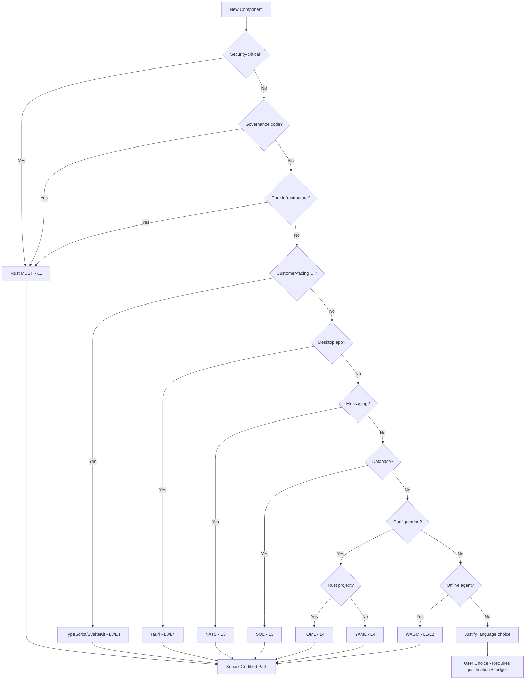
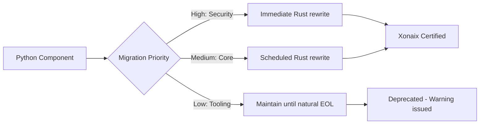

# The Xonaix Way
## Standards Index

**Version:** B-5.8.5
**Core-Compatible:** 5.7.0
**Last Updated:** December 2025

*Registry of all language and domain standards implementing The Xonaix Way.*

---

## Document Info

| Field | Value |
|-------|-------|
| Document Type | Registry |
| Version | B-5.8.5 |
| Core-Compatible | 5.7.0 |
| Created | December 2025 |
| Last Reviewed | December 2025 |

---

## Standards Philosophy

### Purpose of the Standards Library

The Standards Library defines **what "good" looks like** for every language and protocol in the Xonaix ecosystem.

Standards serve three purposes:

1. **Constraint** — Rules for writing new code
2. **Target** — Definition of compliance for legacy transformation
3. **Measurement** — Framework for assessing distance from compliant state

Any language may be used at its appropriate trust level with a conforming standard. The library grows as customer and system needs evolve. When a new language is required, a standard is created following the Language Standard Template.

### Standards and Transformation

Customers may bring:
- **New projects (greenfield)** — Standards constrain generation
- **Existing codebases** — Standards guide refactoring
- **Legacy systems** — Standards define transformation target

In all cases, the standard defines the end state. Forge, Code Core, and human developers all produce code measured against the same standard.

---

## Quick Start: Reading Order by Role

*34+ specification documents can be overwhelming. Start here based on your role.*

### For Auditors

| Order | Document | Purpose |
|-------|----------|---------|
| 1 | CONSTITUTION.md | Supreme authority; immutable principles |
| 2 | SECURITY_LEDGER.md | How evidence is recorded |
| 3 | CERT_MAPPING.md | Control mappings (PCI, HIPAA, CMMC, EU AI Act) |
| 4 | ABG_SPEC.md | Audit bundle generation |
| 5 | OPERATIONAL_PROCEDURES.md | Operational controls |

### For Developers

| Order | Document | Purpose |
|-------|----------|---------|
| 1 | THE_XONAIX_WAY.md | Engineering philosophy (10 Principles) |
| 2 | CODE_CORE.md | Build verification, CI gates |
| 3 | IMPLEMENTATION_REFERENCE.md | Component catalog |
| 4 | BLADE.md | Enforcement layer |
| 5 | This document (STANDARDS_INDEX) | Language standards |

### For Operators

| Order | Document | Purpose |
|-------|----------|---------|
| 1 | OPERATIONAL_PROCEDURES.md | Runbooks, key management |
| 2 | NEXUS.md | API gateway |
| 3 | BUDGET_GATE_SPEC.md | Cost controls |
| 4 | OBSERVABILITY_SPEC.md | Health monitoring, alerts |
| 5 | INCIDENT_RESPONSE_SPEC.md | Incident handling |

### For Security Team

| Order | Document | Purpose |
|-------|----------|---------|
| 1 | CONSTITUTION.md | Authority model |
| 2 | ZERO_POINT_CODEX.md | Procedural governance |
| 3 | HSM_GATE.md | Cryptographic controls |
| 4 | WORC_SPEC.md | Witness network |
| 5 | PARTITION_INTEGRITY_MONITOR.md | Boundary enforcement |

### For Customers

| Order | Document | Purpose |
|-------|----------|---------|
| 1 | THE_XONAIX_WAY.md | What we stand for |
| 2 | Trust Postures in ZERO_POINT_CODEX | Deployment options |
| 3 | NEXUS_UI.md | User interface |
| 4 | METERING_SPEC.md | Usage and billing |

### For AI/Agent Developers

| Order | Document | Purpose |
|-------|----------|---------|
| 1 | CORTEX_PROTOCOL.md | AI governance, deprecation rites |
| 2 | CORTEX_COGNITIVE.md | Cognitive architecture |
| 3 | CQL_SPEC.md | Query language |
| 4 | Constitution Article V | Machine Intelligence Protections |
| 5 | STANDARDS_WASM.md | WASM for Cortex Nano/Lite |

### Complete Document Inventory (35+ Files)

| Layer | Documents |
|-------|-----------|
| **0_Zero Point** | CONSTITUTION, ZERO_POINT_CODEX, ZERO_POINT |
| **1_Cortex** | CORTEX_PROTOCOL, CORTEX_COGNITIVE |
| **2_Blades** | BLADE, BLADE_ZP, BLADE_CX, BLADE_CC |
| **3_Nexus** | NEXUS, NEXUS_UI |
| **4_Code Core** | CODE_CORE, THE_XONAIX_WAY, STANDARDS_INDEX, TEMPLATE_LANGUAGE_STANDARD |
| **5_Forge** | FORGE |
| **Infrastructure** | SECURITY_LEDGER, WORC_SPEC, HSM_GATE, BUDGET_GATE_SPEC, PARTITION_INTEGRITY_MONITOR |
| **Protocols** | CQL_SPEC, RMA_SPEC, AMS_SPEC, CANONICAL_PROFILE, XCLIB_SPEC |
| **Certification** | CERT_MAPPING, ABG_SPEC, HUP_ROADMAP |
| **Operations** | OPERATIONAL_PROCEDURES, IMPLEMENTATION_REFERENCE, METERING_SPEC, OBSERVABILITY_SPEC, INCIDENT_RESPONSE_SPEC |

---

## Language Trust Classes

### Classification Framework

Language Trust Classes define what operations a language may safely perform within Xonaix systems. They do not restrict which languages are permitted — they define capability boundaries.

| Trust Class | Name | Meaning | May Do | May NOT Do |
|-------------|------|---------|--------|------------|
| **L1** | Constitutional | May touch canonical data, crypto, ledger | Sign, verify, canonicalize, hash | — |
| **L2** | Deterministic Compute | Deterministic but not authoritative | Pure computation, transformation | Sign, verify (without L1 delegation) |
| **L3** | Orchestration / Transport | Cannot decide truth | Coordinate, transport, query | Assert truth, infer authority |
| **L4** | Interface / Tooling | Untrusted by default | Display, tooling, scripting | Any governance-affecting operation |

### Current Language Classifications

| Language/Platform | Trust Class | Status | Notes |
|-------------------|-------------|--------|-------|
| Rust (restricted subset) | L1 | CERTIFIED | XCLib, canonical paths, Security Ledger |
| WASM (restricted) | L1 | RESERVED | Cortex Nano/Lite verification |
| Rust (full) | L2 | CERTIFIED | General application code |
| WASM (full) | L2 | RESERVED | General WASM modules |
| TypeScript | L3 | CERTIFIED | Nexus UI, orchestration |
| SQL | L3 | CERTIFIED | Data access, queries |
| NATS | L3 | CERTIFIED | Message transport |
| SvelteKit | L4 | CERTIFIED | UI framework |
| Tauri | L3/L4 | CERTIFIED | Desktop bridge (L3 for IPC, L4 for UI) |
| TOML | L4 | CERTIFIED | Rust configuration |
| YAML | L4 | CERTIFIED | CI/CD configuration |
| Python | L4 | DEPRECATED | Maintenance only, no new development |

### Classification Rules

1. **No Promotion Without Standard** — A language cannot operate at a higher trust class than its standard permits
2. **Explicit Declaration** — Code must declare its intended trust class
3. **Downgrade Permitted** — L1 code may operate as L2/L3/L4; higher trust includes lower
4. **Audit Requirement** — L1 code paths require security audit

### Future Languages

When a new language standard is created:
1. Assess language capabilities and risks
2. Assign appropriate trust class
3. Define constraints that make it safe at that class
4. Add to this table

---

## Cross-Language Requirements

These requirements apply to ALL language standards. Individual standards MUST implement these for their specific language.

### Requirement 1: XCLib Exclusivity (CRITICAL)

**Authority:** Founder Ruling 2025-003(c) — Attested Capability

**Rule:**
> Any code (any language) performing canonicalization, hashing, signing, or verification of Xonaix proofs MUST use XCLib or its official bindings. Direct use of cryptographic primitives outside XCLib is forbidden in governance paths.

**Implementation by Trust Class:**

| Trust Class | Requirement |
|-------------|-------------|
| L1 | Direct XCLib use required |
| L2 | XCLib bindings or delegation to L1 |
| L3 | Must delegate crypto to L1/L2; cannot perform directly |
| L4 | No crypto operations permitted |

**Violation:** Requires ledger-recorded deviation with Founder + Council approval.

**Enforcement:** CI constitutional linter; static analysis per language.

### Requirement 2: Numeric Canonicalization Policy (CRITICAL)

**Authority:** Founder Ruling 2025-003(a) — Determinism

**Rule:**
> Any numeric value that may influence governance, hashing, signing, or verification MUST be represented as integer or fixed-decimal. Implicit coercion and language-default numeric semantics are forbidden for canonical data.

**Implementation by Language:**

| Language | Forbidden | Required |
|----------|-----------|----------|
| Rust | `f32`, `f64` in canonical paths | Integer types, decimal crates |
| TypeScript | `number` for canonical data | `string`, `BigInt` |
| SQL | `FLOAT`, `DOUBLE`, `REAL` in governance tables | `INTEGER`, `DECIMAL`, `NUMERIC` |
| YAML | Implicit numeric typing | Explicit string or integer |
| TOML | Implicit float inference | Explicit integer/decimal |
| WASM | All floating-point operations | Integer arithmetic only |

**Rationale:** JavaScript `number` is IEEE 754 double-precision float. SQL `FLOAT` varies by implementation. YAML `1.0` may parse as integer or float. These create non-determinism across platforms.

### Requirement 3: No Silent Authority (CRITICAL)

**Authority:** Constitution Article I, §4 — Zero Trust

**Rule:**
> No language runtime may infer authority, trust, or posture from context, environment, or configuration. Authority must always be explicit, cryptographically proven, and XCLib-verified.

**Prohibited Patterns:**

| Language | Forbidden Pattern | Required Pattern |
|----------|-------------------|------------------|
| TypeScript | `if (user.role === 'admin')` | Verify signed authority proof |
| SQL | `WHERE role = 'admin'` without posture check | Join with verified authority table |
| Tauri | Assume desktop = trusted | Explicit capability attestation per command |
| SvelteKit | Assume SSR = authoritative | Server is untrusted; verify proofs |
| All | Environment variable authority | Signed configuration only |

**Principle:** Display authority status, never assert it. Verify proofs, never assume them.

### Requirement 4: Exception/Panic Semantics (HIGH)

**Authority:** Founder Ruling 2025-003(b) — Bounded Error Surfaces

**Rule:**
> Error behavior must not leak information or create side channels. Each language must define explicit error handling that maps to bounded public error codes.

**Implementation by Language:**

| Language | Requirement |
|----------|-------------|
| Rust | `panic = abort` in L1/L2 release builds; `Result` types for all fallible operations |
| WASM | `panic = abort`; no unwinding; trap on violation |
| TypeScript | Exceptions caught at boundary; mapped to `PublicErrorCode` |
| SQL | Errors must not leak row data, schema, or query plan |
| YAML/TOML | Parse failures return uniform error; no content in message |

**Rationale:** Different error messages for different failure modes enable oracle attacks. Error timing enables timing attacks. Uniform handling prevents both.

### Requirement 5: Generated Code Accountability (CRITICAL)

**Authority:** Constitutional Actor Model — Equal Standards for All Actors

**Rule:**
> Code produced by Forge, agents, or templates MUST pass the same language standards as human-written code. "Generated" status does not bypass standards.

**Requirements:**

1. **Trust Class Declaration** — Generated code must declare target trust class
2. **Authority Scope** — Generated code must declare intended authority scope
3. **Standard Compliance** — Same linting, testing, review as human code
4. **Provenance** — Generation source recorded (which agent, which template, which version)

**Prohibited:**
- "Generated code exception" in CI
- Reduced review for agent output
- Implicit trust of Forge output

**Rationale:** In the agent era, most code will be generated. If generated code bypasses standards, standards become meaningless. The Constitutional Actor Model requires agents be held to human standards.

---

## Cross-Requirements Summary Table

| Requirement | Applies To | Authority | Enforcement |
|-------------|------------|-----------|-------------|
| XCLib Exclusivity | All crypto/verification | FR 2025-003(c) | CI linter |
| Numeric Policy | All canonical data | FR 2025-003(a) | CI linter |
| No Silent Authority | All authority checks | Constitution I.4 | Code review + CI |
| Exception Semantics | All error handling | FR 2025-003(b) | CI + testing |
| Generated Code | All generated code | Constitutional Actor Model | Same as human code |

---

## Language Policy

> **Rust-first. TypeScript for interfaces. Everything else requires justification.**

| Language | Role | Trust Class | Certification | Notes |
|----------|------|-------------|---------------|-------|
| **Rust** | Primary | L1/L2 | CERTIFIED | All core systems, governance, security |
| **WASM** | Constrained Execution | L1/L2 | RESERVED | Cortex Nano/Lite agents |
| **TypeScript** | Secondary | L3 | CERTIFIED | Customer-facing APIs, web interfaces only |
| **SQL** | Domain | L3 | CERTIFIED | Database queries, RLS policies |
| **YAML** | Configuration | L4 | CERTIFIED | CI/CD, Docker, Kubernetes |
| **TOML** | Configuration | L4 | CERTIFIED | Rust configuration (Cargo.toml) |
| **SvelteKit** | Framework | L4 | CERTIFIED | Nexus frontend |
| **Tauri** | Framework | L3/L4 | CERTIFIED | Desktop application shell |
| **NATS** | Infrastructure | L3 | CERTIFIED | Messaging backbone |
| **Python** | Legacy | L4 | DEPRECATED | Maintenance only, no new development |
| **Other** | User Choice | L4 | NOT CERTIFIED | Warning + ledger record |

---

## Certification Levels

| Level | Requirements | Designation |
|-------|--------------|-------------|
| **Xonaix Certified** | All MUST + all SHOULD | "Built with The Xonaix Way" |
| **Xonaix Compatible** | All MUST | "Xonaix Compatible" |
| **User Choice** | Deviations from MUST | No certification (recorded in ledger) |

---

## NASA/DOD Grade Requirements Summary

All language standards MUST implement these requirements for Controlled classification:

| Requirement | Threshold | Verification |
|-------------|-----------|--------------|
| Bounded loops | ALL loops bounded | Static analysis + review |
| Assertion density | 2+ per function | Linting + review |
| Function size | ≤60 lines MUST, ≤30 SHOULD | Linting |
| Line coverage | ≥95% | CI tooling |
| Branch coverage | ≥90% | CI tooling |
| Property-based testing | Required | Test framework |
| Mutation testing | ≥95% score + justify survivors | cargo-mutants / Stryker |
| Formal verification | Crypto + state machines | Kani / TLA+ |
| Chaos testing | Fault injection | Test framework |
| Dependency vetting | All deps vetted | cargo-vet / npm audit |
| PQC readiness | Design for hybrid | Architecture review |
| FIPS 140-3 | SHOULD -> MUST (2027) | Crypto audit |

---

## Registered Standards

### Active Standards

| Standard | Language/Domain | Version | Trust Class | Core-Compatible | Status |
|----------|-----------------|---------|-------------|-----------------|--------|
| [STANDARDS_RUST.md](language_library/STANDARDS_RUST.md) | Rust | B-5.8.5 | L1/L2 | 5.8.0 | Active |
| [STANDARDS_TYPESCRIPT.md](language_library/STANDARDS_TYPESCRIPT.md) | TypeScript | B-5.8.5 | L3 | 5.8.0 | Active |
| [STANDARDS_SQL.md](language_library/STANDARDS_SQL.md) | SQL | B-5.8.5 | L3 | 5.8.0 | Active |
| [STANDARDS_YAML.md](language_library/STANDARDS_YAML.md) | YAML | B-5.8.5 | L4 | 5.8.0 | Active |
| [STANDARDS_TOML.md](language_library/STANDARDS_TOML.md) | TOML | B-5.8.5 | L4 | 5.8.0 | Active |
| [STANDARDS_NATS.md](language_library/STANDARDS_NATS.md) | NATS | B-5.8.5 | L3 | 5.8.0 | Active |
| [STANDARDS_SVELTEKIT.md](language_library/STANDARDS_SVELTEKIT.md) | SvelteKit | B-5.8.5 | L4 | 5.8.0 | Active |
| [STANDARDS_TAURI.md](language_library/STANDARDS_TAURI.md) | Tauri | B-5.8.5 | L3/L4 | 5.8.0 | Active |

### Transformation Analysis Standards (B-5.8.5)

| Standard | Legacy Language | Version | Status | Notes |
|----------|-----------------|---------|--------|-------|
| [LEGACY_ANALYSIS_TEMPLATE.md](../12.Transformation/LEGACY_ANALYSIS_TEMPLATE.md) | Template | B-5.8.5 | Active | Template for new language standards |

*Note: Legacy analysis standards are created as customer needs arise. The template provides the structure for analyzing and transforming legacy languages (COBOL, Fortran, RPG, PL/I, JCL, etc.) into Xonaix-compliant code.*

### Reserved Standards

| Standard | Language/Domain | Version | Trust Class | Status | Notes |
|----------|-----------------|---------|-------------|--------|-------|
| [STANDARDS_WASM.md](language_library/STANDARDS_WASM.md) | WebAssembly | B-5.8.5 | L1/L2 | Reserved | Cortex Nano/Lite |

### Deprecated Standards

| Standard | Language/Domain | Version | Status | Notes |
|----------|-----------------|---------|--------|-------|
| [STANDARDS_PYTHON.md](language_library/STANDARDS_PYTHON.md) | Python | 1.0.0 | DEPRECATED | Legacy maintenance only |

---

## Language Selection Decision Tree



---

## Python Migration Guide

Python code in the Xonaix ecosystem is deprecated. All Python components should be migrated to Rust.



**Migration Priority Criteria:**

| Priority | Criteria | Timeline |
|----------|----------|----------|
| **High** | Security-critical, handles secrets, authentication | Immediate |
| **Medium** | Core business logic, data processing | Next quarter |
| **Low** | Internal tooling, scripts, one-off utilities | Natural EOL |

---

## Creating New Standards

Use [TEMPLATE_LANGUAGE_STANDARD.md](TEMPLATE_LANGUAGE_STANDARD.md) as the base for any new language standard.

### Mandatory Sections (B-5.8.5+)

All language standards MUST include:

| Section | Purpose |
|---------|---------|
| Trust Class | L1-L4 classification and implications |
| XCLib Integration | How crypto is handled (or prohibited) |
| Numeric Policy | Float ban implementation |
| Capability & Posture Handling | Authority verification patterns |
| Error Handling | Exception/panic semantics |
| Durability Strategy | Principle 9 implementation |
| Generated Code | Forge/agent code requirements |

### Graduation Checklist

Before a standard can move from Interim to Active status:

**Core Requirements:**
- [ ] Core-Compatible explicitly declared (currently 5.7.0)
- [ ] Trust Class declared with implications
- [ ] All 9 principles mapped to language-specific implementations
- [ ] Deviation Recording syntax defined for the language
- [ ] XCLib Integration section complete
- [ ] Numeric Policy section complete
- [ ] Capability & Posture section complete
- [ ] Error Handling section complete
- [ ] Durability Strategy section complete
- [ ] Generated Code section complete

**NASA/DOD Grade Requirements:**
- [ ] Bounded execution patterns defined
- [ ] Assertion density patterns defined
- [ ] Function size limits defined
- [ ] Coverage thresholds defined (95%/90% for Controlled)
- [ ] Property-based testing patterns and tools specified
- [ ] Mutation testing patterns and tools specified (≥95% for Controlled)
- [ ] Formal verification tools specified (where applicable)
- [ ] Chaos testing patterns defined

**Security Requirements:**
- [ ] Post-quantum crypto pattern defined (hybrid Ed25519 + ML-DSA for Tier 3-4)
- [ ] FIPS 140-3 roadmap documented
- [ ] Dependency vetting process defined
- [ ] Unsafe/dangerous feature tracking defined

**Principle 9 (Nothing Lost, Ever):**
- [ ] Persistence patterns defined for the language/domain
- [ ] ACK-based processing patterns defined
- [ ] Recovery patterns defined

**Documentation:**
- [ ] Xona Prompt Appendix complete and tested
- [ ] CI pipeline example complete with all checks
- [ ] Quick reference section complete
- [ ] All code examples verified to compile/run
- [ ] Language justification with quantifiable metrics

**Review:**
- [ ] Red Team review completed
- [ ] Blue Team review completed
- [ ] White Team (Constitutional) review completed
- [ ] Green Team (Sustainability) review completed
- [ ] All blocking issues resolved

---

## Language Justification Template

When proposing a new language or using a non-certified language:

```markdown
## Language Justification: [Language Name]

### Trust Class Assignment

| Attribute | Value |
|-----------|-------|
| Proposed Trust Class | L[1-4] |
| Rationale | [Why this class] |

### Quantifiable Metrics

| Metric | Value | Comparison to Rust |
|--------|-------|-------------------|
| Memory safety | [Yes/No/Partial] | [Better/Same/Worse] |
| Type safety | [Strong/Weak/None] | [Better/Same/Worse] |
| Concurrency model | [Description] | [Better/Same/Worse] |
| Ecosystem maturity | [Years, crate count] | [Better/Same/Worse] |
| Security audit tooling | [Available tools] | [Better/Same/Worse] |
| Formal verification support | [Available tools] | [Better/Same/Worse] |

### Cross-Language Requirements

| Requirement | Implementation |
|-------------|----------------|
| XCLib Integration | [How] |
| Numeric Policy | [How] |
| No Silent Authority | [How] |
| Exception Semantics | [How] |
| Generated Code | [How] |

### Justification

[Why Rust cannot be used for this specific case]

### Risk Assessment

[Security and maintenance risks of using this language]

### Migration Path

[How this could be migrated to Rust in the future if needed]

### Approvals

- [ ] Architecture review
- [ ] Security review
- [ ] Governance review
```

---

## CI Template Governance

**Owner:** Blade_CC maintainers
**Template:** `xw-ci.yml` in `xonaix/standards` repository
**Oversight:** White Team via CODEOWNERS

**CODEOWNERS Configuration:**
```
# .github/CODEOWNERS (xonaix/standards)
/.github/workflows/xw-ci.yml @xonaix/white-team @xonaix/blade-cc
```

**Change Approval Matrix:**

| Change Type | Required Approvers |
|-------------|-------------------|
| Bug fixes / non-threshold | Blade_CC maintainers |
| Threshold changes (coverage, mutation) | Blade_CC + Blue Team |
| Gate additions/removals | Blade_CC + White Team |
| Security gate changes (audit, vet, geiger) | Blade_CC + Red Team + White Team |
| Cross-language requirement changes | Blade_CC + White Team + Founder |

**Break Glass for CI:**
- P0 fixes may use Break Glass protocol
- Post-fix White Team review within 48h required
- Remediation documented in Security Ledger

---

## Version Alignment

Standards use semantic versioning independent of Core-Version. Each standard declares its Core-Compatible version.

| Document | Current Version | Core-Compatible |
|----------|-----------------|-----------------|
| THE_XONAIX_WAY.md | B-5.8.5 | Defines Core |
| STANDARDS_INDEX.md | B-5.8.5 | 5.7.0 |
| STANDARDS_RUST.md | B-5.8.5 | 5.7.0 |
| STANDARDS_TYPESCRIPT.md | B-5.8.5 | 5.7.0 |
| STANDARDS_SQL.md | B-5.8.5 | 5.7.0 |
| STANDARDS_YAML.md | B-5.8.5 | 5.7.0 |
| STANDARDS_TOML.md | B-5.8.5 | 5.7.0 |
| STANDARDS_SVELTEKIT.md | B-5.8.5 | 5.7.0 |
| STANDARDS_TAURI.md | B-5.8.5 | 5.7.0 |
| STANDARDS_NATS.md | B-5.8.5 | 5.7.0 |
| STANDARDS_WASM.md | B-5.8.5 | 5.7.0 |
| TEMPLATE_LANGUAGE_STANDARD.md | B-5.8.5 | 5.7.0 |

**Versioning Rules:**
- Standard version increments when content changes
- Core-Compatible indicates which Core requirements are implemented
- Standards at earlier versions remain valid if reviewed for current Core compatibility

---

## Governance Appendices

| Appendix | Location | Content |
|----------|----------|---------|
| Threat Model: Insider & Xona | THE_XONAIX_WAY.md | Insider threat assumptions and controls |
| CI Template Governance | STANDARDS_INDEX.md | Ownership and change approval |
| Cross-Language Requirements | STANDARDS_INDEX.md | XCLib, Numeric, Authority, Errors, Generated Code |

---

## Changelog

### B-5.8.5 (December 2025)
- **MAJOR:** Added Language Trust Classes (L1-L4) framework
- **MAJOR:** Added Cross-Language Requirements section
  - XCLib Exclusivity Rule
  - Numeric Canonicalization Policy
  - No Silent Authority Rule
  - Exception/Panic Semantics
  - Generated Code Accountability
- **ADDED:** STANDARDS_WASM.md (Reserved) for Cortex Nano/Lite
- **ADDED:** Standards Philosophy section (Constraint, Target, Measurement)
- **ADDED:** Mandatory sections list for new standards
- **UPDATED:** All standards to B-5.8.5 with new required sections
- **UPDATED:** Graduation checklist with new requirements
- **UPDATED:** Language justification template with Trust Class
- **Source:** Red-Blue-Black Team synthesis with Founder approval

### B-5.6.0 (December 2025)
- **Green Team Sustainability Review:**
- **ADDED:** Quick Start / Reading Order section with role-based document paths
- **ADDED:** Complete Document Inventory (34 files)
- **ADDED:** METERING_SPEC.md to registry (billing instrumentation)
- **ADDED:** OBSERVABILITY_SPEC.md to registry (health monitoring)
- **ADDED:** INCIDENT_RESPONSE_SPEC.md to registry (incident handling)
- **UPDATED:** Cross-references to B-5.6.0 ecosystem

### v5.4.0 (December 2025)
- **White Team Constitutional Review:** Version alignment with v5.4.0 ecosystem

### v5.3.0 (December 2025)
- **Red-Blue Team Block 5 Final Synthesis:** Version alignment with v5.3.0 ecosystem

### v5.2.0 (December 2025)
- **Red-Blue Team Block 5 Synthesis:**
- **ADDED:** CANONICAL_PROFILE.md to registry (canonicalization rules)
- **ADDED:** XCLIB_SPEC.md to registry (canonical engine)
- **ADDED:** PARTITION_INTEGRITY_MONITOR.md to registry (partition verification)
- **ADDED:** HSM_GATE.md to registry (HSM compensating controls)
- **ADDED:** CERT_MAPPING.md to registry (certification evidence)
- **ADDED:** ABG_SPEC.md to registry (audit bundle generator)
- **UPDATED:** Cross-references to v5.2.0 ecosystem

### v5.1.0 (December 2025)
- **RATIFIED:** Rainbow Team consensus (Red-Blue-White-Green)
- **ADDED:** Cryptographic deviation recording with Zero Point binding
- **ADDED:** Multi-Party Authorization (MPA) with Solo Founder provision
- **ADDED:** PQC Phase Governance (White Team + Founder approval for Phase 3)
- **ADDED:** Threat Model Appendix (Insider & Xona assumptions)
- **ADDED:** Audit Hash Policy (BLAKE3/SHA3-512 tiering) in NATS
- **ADDED:** Subject Authorization Policy (least-privilege NATS)
- **ADDED:** Controlled Shell Access (FIDO2 signed intent) in Tauri
- **ADDED:** Dynamic Identifiers §1.4 (SQL whitelists MUST)
- **ADDED:** Reproducible Builds (Controlled) in Rust
- **ADDED:** PQC Structural Requirement in Rust
- **ADDED:** CI Template Governance (Blade_CC ownership)
- **UPDATED:** Status to "Rainbow Team Approved"
- **UPDATED:** RUST, SQL, NATS, TAURI standards to v5.1.0

### v5.0.0 (December 2025)
- **ALIGNED:** Core-Version updated to 5.0.0
- **ADDED:** Certification Levels section
- **ADDED:** NASA/DOD Grade Requirements Summary
- **ADDED:** SvelteKit, Tauri, NATS standards to registry
- **ADDED:** Language Selection Decision Tree (Mermaid)
- **ADDED:** Python Migration Guide with Mermaid diagram
- **ADDED:** Expanded graduation checklist (~25 items)
- **ADDED:** Language justification template with quantifiable metrics
- **UPDATED:** All registered standards to v5.0.0
- **UPDATED:** Graduation checklist with PQC, FIPS, Principle 9 requirements

### v1.1.0 (December 2025)
- Added: Core-Version field
- Added: Python deprecation notice
- Added: Language selection guidance

### v1.0.0 (December 2025)
- Initial release

---

*Standards Index B-5.8.5 — Part of The Xonaix Way B-5.8.5*

*"Standards define what 'good' looks like — for new code and legacy transformation alike."*

*Xonaix, Inc. — Intelligence, evolved.*
