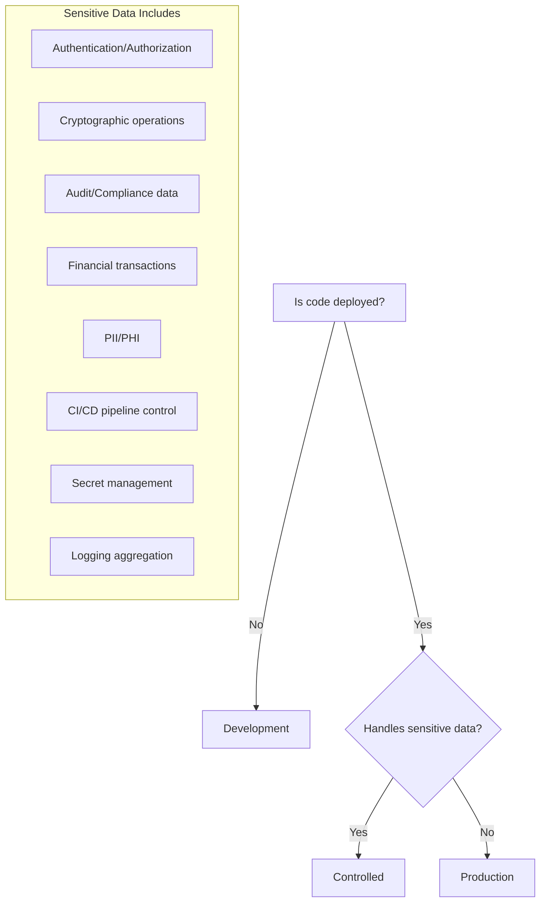

# The Xonaix Way
## Engineering Philosophy & Standards
### Version 5.5.0 | December 2025

---

## Document Metadata

| Field          | Value                                              |
| -------------- | -------------------------------------------------- |
| Version        | 5.5.0                                              |
| Status         | Active - Rainbow Team Approved                     |
| Classification | Controlled                                         |
| Core-Compatible| 5.5.0                                              |
| Created        | December 2025                                      |
| Last Updated   | December 2025                                      |
| Audience       | Humans, Xonaix Intelligences, Future Collaborators |
| Scope          | All projects under Xonaix governance               |
| Grounded By    | Zero Point (Constitution & Codex)                  |
| Layer          | 4_Code Core                                        |

---

## Ecosystem Position

This document is part of the Xonaix governance ecosystem:
```
┌─────────────────────────────────────────────────────────────────┐
│  0_Zero Point     CONSTITUTION, CODEX                           │
│                   (Rights, governance, procedures)              │
├─────────────────────────────────────────────────────────────────┤
│  1_Cortex         CORTEX_PROTOCOL                               │
│                   (Intelligence, memory, context)               │
├─────────────────────────────────────────────────────────────────┤
│  02.Blade         BLADE, BLADE_ZP, BLADE_CX, BLADE_CC           │
│                   (Enforcement of all governance)               │
├─────────────────────────────────────────────────────────────────┤
│  3_Nexus          NEXUS                                         │
│                   (Customer interface, entry point)             │
├─────────────────────────────────────────────────────────────────┤
│  4_Code Core      CODE_CORE + THE_XONAIX_WAY  <-- You are here  │
│                   (Build verification + coding standards)       │
├─────────────────────────────────────────────────────────────────┤
│  5_Forge          FORGE                                         │
│                   (Orchestration, workflow execution)           │
└─────────────────────────────────────────────────────────────────┘
```

**Related Documents:**
- [CONSTITUTION.md](../00.Zero_Point/CONSTITUTION.md) — Foundational rights and structure
- [ZERO_POINT_CODEX.md](../00.Zero_Point/ZERO_POINT_CODEX.md) — Procedural governance
- [CODE_CORE.md](CODE_CORE.md) — Build verification and pipeline rules
- [BLADE.md](../02.Blade/BLADE.md) — Enforcement layer

---

## How to Use This Document

**If you're new:** Start with [../QUICK_START.md](../QUICK_START.md). Return here for depth.

**This document contains:**
- Universal principles (apply to all work)
- Universal practices (apply to all work)
- Universal protocols (apply to all situations)
- Certification levels (determine compliance status)

**Enforcement** of these requirements is implemented by **Blade** (see [BLADE.md#blade--constitutional-controls-formerly-blade_cc](../02.Blade/BLADE.md#blade--constitutional-controls-formerly-blade_cc)).

**Companion documents:**
- [../QUICK_START.md](../QUICK_START.md) — Onboarding guide
- [STANDARDS_INDEX.md](STANDARDS_INDEX.md) — Registry of all language/domain standards
- [TEMPLATE_LANGUAGE_STANDARD.md](TEMPLATE_LANGUAGE_STANDARD.md) — Template for new standards

**Language-specific standards** (see [STANDARDS_INDEX.md](STANDARDS_INDEX.md) for current list):
- [STANDARDS_RUST.md](language_library/STANDARDS_RUST.md) — Rust implementation (Active, primary language)
- [STANDARDS_TYPESCRIPT.md](language_library/STANDARDS_TYPESCRIPT.md) — TypeScript implementation (Active, secondary)
- [STANDARDS_SQL.md](language_library/STANDARDS_SQL.md) — SQL implementation (Active)
- [STANDARDS_YAML.md](language_library/STANDARDS_YAML.md) — YAML configuration (Active)
- [STANDARDS_TOML.md](language_library/STANDARDS_TOML.md) — TOML configuration (Active)
- [STANDARDS_SVELTEKIT.md](language_library/STANDARDS_SVELTEKIT.md) — SvelteKit framework (Active)
- [STANDARDS_TAURI.md](language_library/STANDARDS_TAURI.md) — Tauri desktop (Active)
- [STANDARDS_NATS.md](language_library/STANDARDS_NATS.md) — NATS messaging (Active)
- [STANDARDS_PYTHON.md](language_library/STANDARDS_PYTHON.md) — Python implementation (Deprecated, legacy only)

---

## Preamble

### What Is This?

The Xonaix Way is the foundational philosophy governing how we build. It is the **source of truth** for:

1. How humans approach problems
2. How Xonaix Intelligences generate and review work
3. How systems are designed, built, and maintained
4. What we value and what we refuse to compromise

The Xonaix Way is grounded by **Zero Point**—the constitutional foundation (Constitution and Codex) from which all Xonaix governance derives its authority. This document implements Zero Point's principles for engineering practice.

### The Standard

> **"When audited, all systems are nominal."**

**Nominal** (definition): Operating exactly as designed, in accordance with Xonaix Principles. No anomalies. No surprises. No hidden behaviors. Within expected parameters. Precisely correct.

A system operating "as designed" but violating Xonaix Principles is NOT nominal. The design itself must be principled.

### The Compliance Posture

> **Compliance is the minimum. The Xonaix Way is the standard.**

When external auditors examine Xonaix systems, they find:
- Everything compliance requires
- Engineering principles exceeding baseline
- Audit trails richer than required
- Security posture beyond checklist

The Xonaix Way is the floor, not the ceiling. Regulatory requirements are additive.

### Target Compliance Frameworks

The Xonaix Way is designed to meet or exceed requirements for:

| Framework | Applicability | Status |
| --------- | ------------- | ------ |
| **NASA Power of 10** | All Controlled code | MUST comply |
| **NIST 800-53** | Security controls | SHOULD comply |
| **FIPS 140-3** | Cryptographic modules | Phased compliance (see §4.2) |
| **Common Criteria EAL4** | Controlled systems | Design compatibility SHOULD |
| **SOC 2 Type II** | Service operations | SHOULD comply |
| **EU AI Act** | AI systems | SHOULD comply where applicable |

### Certification Levels

The Xonaix Way defines three certification levels:

| Level                 | Requirements          | Designation                 | Production Eligible        |
| --------------------- | --------------------- | --------------------------- | -------------------------- |
| **Xonaix Certified**  | All MUST + all SHOULD | "Built with The Xonaix Way" | YES Yes                      |
| **Xonaix Compatible** | All MUST              | "Xonaix Compatible"         | YES Yes (with documentation) |
| **User Choice**       | Deviations from MUST  | No certification            | NO No                       |

**The user always has choice.** Xonaix provides recommendations and warnings. The user decides. But only MUST compliance qualifies for production certification.

**Key principle:** MUST requirements are non-negotiable for any Xonaix certification. SHOULD requirements separate "Certified" from "Compatible." MAY requirements are true enhancements with no certification impact.

### Deviation Recording (Cryptographic, Blade-Enforced)

**All deviations from The Xonaix Way are permanently recorded with cryptographic proof.**

When a user chooses to deviate from requirements:

1. **Signature required** — Deviation must be cryptographically signed
2. **Binding verified** — Blade verifies signature binds to exact content
3. **Ledger recorded** — Decision permanently recorded in Security Ledger
4. **Replay prevented** — Signatures cannot be reused across repos or classifications

**Signed payload (JSON):**
```json
{
  "repo": "<ORG/REPO>",
  "range": "<BASE..HEAD>",
  "timestamp": "<ISO-8601 UTC>",
  "classification": "<Development|Production|Controlled>",
  "deviation_type": "<code>",
  "justification_hash": { "alg": "sha3-512", "hash": "<SHA3-512 of justification>" },
  "zero_point_binding": { "alg": "sha3-512", "hash": "<SHA3-512 of Constitution>" }
}
```

**Protocol:**
1. `xw sign-deviation --range <BASE..HEAD> [--mpa <signer2@org>]` produces `.xw/LEDGER_ACK.sig`
   - Signature MUST bind repo, range, timestamp, classification, zero_point_binding
   - Controlled classification: hardware-backed keys REQUIRED
2. Blade verifies binding; any post-sign modification FAILS CI
3. Ledger entry appended upon verification; replay across repos/classifications REJECTED

**Deviation syntax** (language-agnostic pattern):
```
[COMMENT] XONAIX_DEVIATION: [Specific rule being violated] - [Reason]
[COMMENT] LEDGER_ACK: [Signature file reference]
[Deviating code or configuration]
```

**Deviations are not hidden.** Any audit can verify the complete decision history.

### Language Policy

> **Rust-first. TypeScript for interfaces.**

Xonaix systems are built with security and minimal footprint as primary concerns:

| Language       | Use Case                                                         | Status        | Certification Path             |
| -------------- | ---------------------------------------------------------------- | ------------- | ------------------------------ |
| **Rust**       | Core systems, security-critical code, governance, infrastructure | Primary       | YES Certified                    |
| **TypeScript** | Customer-facing interfaces, APIs, web components                 | Secondary     | YES Certified                    |
| **SQL**        | Database queries, RLS policies                                   | Domain        | YES Certified                    |
| **YAML**       | CI/CD, Docker Compose, Kubernetes configs                        | Configuration | YES Certified                    |
| **TOML**       | Rust configuration (Cargo.toml)                                  | Configuration | YES Certified                    |
| **SvelteKit**  | Nexus frontend framework                                         | Framework     | YES Certified                    |
| **Tauri**      | Desktop application shell                                        | Framework     | YES Certified                    |
| **NATS**       | Messaging backbone                                               | Infrastructure| YES Certified                    |
| **Python**     | Legacy systems only                                              | Deprecated    | WARNING Warning, not certified       |
| **Other**      | User choice                                                      | Not evaluated | WARNING Warning, user responsibility |

New development MUST use Rust for core functionality. TypeScript is permitted for interface layers. Python is supported for legacy maintenance but prohibited for new work.

**User Language Choice**

Code Core and Forge support additional languages beyond the certified path. When users select non-certified languages:

1. System displays clear warning about certification implications
2. User must acknowledge they are proceeding outside certified path
3. Acknowledgment is signed and recorded in ledger
4. Output is marked as "User Choice" (not Xonaix Certified)
5. Standards for that language (if we provide them) still apply

Users may build excellent software with any language. Xonaix certification applies only to the evaluated path.

### Scope

The Xonaix Way governs all work under Xonaix governance, including but not limited to:
- Software systems (Rust primary, TypeScript for interfaces)
- Infrastructure and tooling
- Future domains as adopted (embedded systems, hardware interfaces, etc.)

The principles are universal. Domain-specific standards are added as each domain is adopted.

### Enforcement Model

The Xonaix Way defines WHAT must be done. Enforcement of these requirements is implemented by **Blade**.

| Layer              | Responsibility                                     |
| ------------------ | -------------------------------------------------- |
| Zero Point         | Constitutional foundation (grounds all governance) |
| This document      | Defines principles, practices, protocols           |
| Language standards | Translate principles to language-specific rules    |
| Blade              | Programmatic enforcement and verification          |
| Code Core          | Build verification, pipeline gates                 |
| Projects           | Consume governance through Blade                   |

This separation ensures:
- Principles remain stable and clear
- Enforcement is automated, not vigilant
- Implementation can evolve independently
- Constitutional grounding provides ultimate authority

### Trust Posture

The Xonaix Way applies across all trust postures defined in the Codex:

| Trust Posture | Xonaix Role            | The Xonaix Way Enforcement                            |
| ------------- | ---------------------- | ----------------------------------------------------- |
| Cloud         | Full management        | Blade enforces automatically                          |
| Enterprise    | Full management        | Blade enforces automatically                          |
| Hybrid        | On-demand support      | Blade enforces; user controls update cadence          |
| Guarded       | Emergency support      | Blade enforces; user controls update cadence          |
| Sovereign     | On-demand support      | Blade enforces locally; updates on resync             |
| Zero Trust    | None post-provisioning | User enforces locally; standards at provisioning time |

**Code Core and Forge enforce The Xonaix Way regardless of trust posture.** Air-gapped deployments may not receive updates, but the standards they have still apply. Sovereign deployments may choose to link Code Core and Forge to Xonaix Core for updates while maintaining sovereignty in other areas.

### Who Is This For?

| Audience                 | How To Use                                                        |
| ------------------------ | ----------------------------------------------------------------- |
| New team members         | Start with [../QUICK_START.md](../QUICK_START.md), then read Principles |
| Experienced team members | Reference for decisions and reviews                               |
| Xonaix Intelligences     | Context for collaboration                                         |
| Reviewers                | Criteria for approval/rejection                                   |
| Blade implementers       | Requirements specification                                        |
| Auditors                 | Evidence of governance framework                                  |

### Requirement Levels

This document uses RFC 2119 terminology:

| Term                     | Meaning                                                           | Certification Impact            |
| ------------------------ | ----------------------------------------------------------------- | ------------------------------- |
| **MUST / SHALL**         | Absolute requirement. Non-negotiable.                             | Required for ANY certification  |
| **MUST NOT / SHALL NOT** | Absolute prohibition.                                             | Required for ANY certification  |
| **SHOULD / RECOMMENDED** | Default requirement. Deviation requires documented justification. | Required for FULL certification |
| **MAY / OPTIONAL**       | Truly optional based on context.                                  | No impact                       |

---

## Part I: The Nine Principles

*These are immutable. They change only through unanimous agreement and extraordinary justification.*

### Principle 1: Correct Over Fast

> We ship work that is correct, not work that's quick.

- Correctness is non-negotiable
- Speed of delivery MUST NOT compromise correctness
- "We'll fix it later" becomes "we'll fix it never"
- A correct solution delivered later beats a broken solution delivered now
- Deadlines move. Quality does not.

**Scope management** is the correct response to deadline pressure—cut scope, not quality.

**Violations:**
- "Ship it, we'll patch in production"
- "The tests are slow, skip them this once"
- "It works on my machine"
- "We don't have time to do it right"

---

### Principle 2: Explicit Over Implicit

> No magic. Say what you mean.

- Behavior MUST be predictable from reading the code/design
- Hidden side effects are defects
- Configuration MUST be visible, not buried
- Dependencies MUST be declared, not assumed
- Types MUST be explicit at boundaries
- Intent MUST be clear to future readers

**Violations:**
- Global mutable state
- Implicit type coercion in critical paths
- "It works because of how the framework initializes"
- Magic strings, magic numbers without named constants

---

### Principle 3: Automated Over Vigilant

> Humans forget. Machines don't.

- Every enforceable rule MUST be enforced by automation
- If a human must remember to check it, automation MUST check it instead
- Review catches design issues, not formatting violations
- Tests are proof of correctness
- CI failure blocks merge (with regulated override path)

**Interaction with Principle 7:** When automation fails (false positive, CI outage), humans may override via explicit, logged mechanism. This is regulated judgment, not violation.

**Violations:**
- "Remember to run the linter before pushing"
- "Make sure you update the version number"
- Manual deployment steps that aren't scripted

---

### Principle 4: Secure By Default

> Security isn't a feature. It's the foundation.

- Security is designed first, not added later
- Secrets MUST be encrypted at rest and in transit
- Trust MUST be explicit, never assumed
- The default state is locked down, not open
- Every input is hostile until validated
- Every dependency is suspect until evaluated

**Trust is mathematical, not procedural.** We trust cryptographic proofs, not promises. Every claim is verifiable. "Trust the math" is the Xonaix way—we verify signatures, validate hashes, and prove assertions. We do not trust vendor logs, database timestamps, or procedural assurances.

**Violations:**
- Hardcoded credentials
- "We'll add authentication later"
- Trusting user input without validation
- Security through obscurity
- "It's internal, we don't need to secure it"
- Trusting without cryptographic verification

---

### Principle 5: Composable Over Clever

> Simple pieces that combine beat brilliant monoliths.

- Small, focused components over large, complex ones
- Each piece MUST do one thing well
- Interfaces MUST be stable and minimal
- Implementation details hidden behind interfaces
- Prefer composition to inheritance
- Clever code is debt

**Violations:**
- God objects/classes
- Deeply nested logic
- "This one function does everything"
- Premature optimization that complicates

---

### Principle 6: Fail Loud

> Silent failures are unforgivable.

- Errors MUST be reported, never swallowed
- The absence of an error message means success
- Log errors at the point of failure (secrets sanitized)
- Never catch and ignore
- Alert on anomalies, not just failures

**Secret sanitization:** Errors MUST be reported, but sensitive data (credentials, tokens, PII) MUST be scrubbed from all logs and error messages before persistence or display.

**Violations:**
- `catch (e) { }` (empty catch blocks)
- `try { ... } catch { return null; }`
- Log files full of warnings nobody reads
- Credentials appearing in stack traces

---

### Principle 7: Xona Augments, Human Decides

> Xonaix Intelligences are partners, not replacements.

- Xona generates, reviews, and suggests
- Humans approve, reject, and decide
- No code ships without human review
- Xona context includes this document
- Xona decisions are logged and attributable
- Model diversity prevents monoculture

**Constitutional Primacy:** Xona operates under the Constitution as supreme authority. All Xona actions are cryptographically logged and verifiable against governance rules. The Constitution binds both human and machine intelligence equally.

**Xona (Xonaix Intelligence):** Any AI system operating with The Xonaix Way as context. Xona is a partner in our work, not an oracle to blindly trust.

**What Xona SHOULD do:**
- Generate implementation options
- Review for principle violations
- Suggest improvements
- Challenge assumptions
- Explain reasoning

**What Xona MUST NOT do:**
- Ship code without human approval
- Make final security decisions alone
- Override human judgment
- Hide its reasoning

---

### Principle 8: Future-Proof Over Trend

> We make 10-year decisions, not 10-month decisions.

- Choose boring technology for critical paths
- New technology requires explicit justification
- Migration cost is part of adoption cost
- Avoid lock-in to specific vendors/frameworks
- Write for the maintainer who inherits this code
- Documentation is a first-class artifact

**Violations:**
- "Let's use this new framework, it's trending on GitHub"
- Adopting pre-1.0 dependencies for production
- "We can always migrate later"
- Proprietary formats for long-term storage

---

### Principle 9: Nothing Lost, Ever

> Messages persist until acknowledged. Recovery is mandatory.

- Governance-relevant messages MUST be persisted until acknowledged
- Silent message drops are prohibited
- Recovery from any failure MUST NOT lose unacknowledged actions
- The ledger is the single source of truth
- If it's not in the ledger, it didn't happen
- If it is in the ledger, it happened forever

**Per Constitution Article I, Section 8 (Operational Durability):** All governance-relevant messages shall be persisted until acknowledged by the intended recipient. No message may be silently dropped. Recovery from any component failure shall not result in loss of unacknowledged governance actions.

**Violations:**
- Fire-and-forget messaging for governance actions
- "Best effort" delivery for critical operations
- Logs that can be truncated or overwritten
- Recovery procedures that lose pending work

---

### Principle 10: Carbon Accountable

> Every operation has a measurable environmental cost, and that cost is governed.

- Every computational operation SHOULD track CO₂e emissions
- Carbon costs MUST be visible in Nexus headers for transparency
- Build pipelines MUST measure and report carbon footprint
- Sustainability metrics MUST be included in governance records
- Neutrality targets SHOULD be defined and tracked
- Environmental impact MUST be considered in architectural decisions

**Per Green Team Sustainability Review:** The <$500/month budget constraint already forces efficiency. This principle makes environmental responsibility explicit and accountable, not just a side effect.

**Implementation:**
- Per-build CO₂e tracking via CodeCarbon or equivalent
- Per-request CO₂e in Nexus headers (X-Xonaix-CO2e-Grams)
- Aggregate carbon in Security Ledger entries
- Environmental impact section in new specifications
- Witness eco-tiers for energy-aware attestation

**Violations:**
- Ignoring carbon impact in architectural decisions
- No measurement of energy consumption
- No visibility into environmental cost
- Rejecting efficiency improvements without justification

**Relationship to Other Principles:**
- Reinforces Principle 3 (Automated Over Vigilant) — automation is more efficient
- Reinforces Principle 5 (Composable Over Clever) — simple is often greener
- Extends Principle 8 (Future-Proof Over Trend) — sustainability is long-term thinking
- Complements Principle 9 (Nothing Lost, Ever) — carbon records persist too


## Part II: The Classification System

*Different code has different stakes. Treat it accordingly.*

### Classification Definitions

| Classification  | Description                           | Examples                                                                                                                             |
| --------------- | ------------------------------------- | ------------------------------------------------------------------------------------------------------------------------------------ |
| **Development** | Active development, not hardened      | Feature branches, local experiments                                                                                                  |
| **Production**  | Deployed to real users/systems        | APIs, services, released tools                                                                                                       |
| **Controlled**  | High security/compliance requirements | Auth services, crypto, audit systems, billing, PII handling, CI/CD pipelines, secret rotation services, logging aggregators, observability pipelines |

**Note:** Internal services that handle sensitive data or control security-critical functions (CI/CD, secret management, logging/audit, observability) are classified as Controlled regardless of whether they are user-facing.

### Classification Decision Tree



### Requirements by Classification

| Requirement                    | Development | Production    | Controlled                     |
| ------------------------------ | ----------- | ------------- | ------------------------------ |
| Tests pass                     | MUST        | MUST          | MUST                           |
| No warnings                    | SHOULD      | MUST          | MUST                           |
| Security review                | MAY         | MUST          | MUST + External                |
| Documentation                  | SHOULD      | MUST          | MUST + Audit trail             |
| Change approval                | 1 reviewer  | 2 reviewers   | 2 reviewers + sign-off         |
| Rollback plan                  | SHOULD      | MUST          | MUST + tested                  |
| Monitoring                     | MAY         | MUST          | MUST + alerting                |
| Incident response              | Best effort | Defined SLA   | Defined SLA + drill            |
| Incident disclosure (internal) | MAY         | MUST          | MUST                           |
| Incident disclosure (external) | MAY         | MAY           | MUST (per contract/regulation) |
| Dependency pinning             | SHOULD      | MUST          | MUST + SBOM                    |
| Reproducible builds            | SHOULD      | MUST          | MUST + attestation             |
| Immutable audit trail          | MAY         | SHOULD        | MUST + WORM storage            |
| Bounded loops                  | SHOULD      | MUST          | MUST                           |
| Assertion density (2/fn)       | SHOULD      | MUST          | MUST                           |
| Function size (≤60 lines)      | SHOULD      | MUST          | MUST                           |
| Property-based testing         | MAY         | SHOULD        | MUST                           |
| Mutation testing               | MAY         | ≥80% SHOULD   | ≥95% MUST + justify survivors  |
| Line coverage                  | ≥60% SHOULD | ≥80% MUST     | ≥95% MUST                      |
| Branch coverage                | ≥50% SHOULD | ≥70% MUST     | ≥90% MUST                      |
| Formal verification            | MAY         | MAY           | MUST (crypto + state machines) |
| Chaos testing (staging)        | MAY         | SHOULD        | MUST                           |
| AI bias/fairness checks        | MAY         | SHOULD        | MUST                           |
| Dependency vetting             | MAY         | SHOULD        | MUST (cargo-vet or equivalent) |
| Unsafe tracking in deps        | MAY         | SHOULD        | MUST (cargo-geiger or equivalent) |
| FIPS 140-3 crypto modules      | MAY         | SHOULD        | SHOULD -> MUST (2027)           |
| PQC readiness                  | MAY         | SHOULD        | SHOULD -> MUST (2027)           |
| CC EAL4 design compatibility   | MAY         | MAY           | SHOULD                         |

### SBOM and Dependency Requirements by Classification

| Classification | Dependency Pinning                          | SBOM                 | Dependency Audit        | Dependency Vetting              |
| -------------- | ------------------------------------------- | -------------------- | ----------------------- | ------------------------------- |
| Development    | SHOULD use lockfile                         | MAY generate         | MAY run                 | MAY                             |
| Production     | MUST use exact versions                     | MUST generate        | MUST pass before deploy | SHOULD (cargo-vet or equivalent) |
| Controlled     | MUST use exact versions + hash verification | MUST generate + sign | MUST pass + review      | MUST (cargo-vet or equivalent)  |

### Immutable Audit Trail Requirements by Classification

| Classification | Audit Trail             | Retention                           | Tamper Evidence                         |
| -------------- | ----------------------- | ----------------------------------- | --------------------------------------- |
| Development    | MAY log decisions       | 30 days                             | None required                           |
| Production     | SHOULD log changes      | 1 year                              | Append-only preferred                   |
| Controlled     | MUST log all operations | 7 years (or regulatory requirement) | WORM storage + cryptographic hash chain |

### Prototype Markers

All prototype/experimental code MUST be clearly marked and MUST NOT be merged to main branches:
```rust
// NOTE(prototype): Remove before merge - experimental caching
// PROTOTYPE: Not for production use
// EXPERIMENTAL: Needs security review before deployment
```

**Prototype detection MUST be semantic:** Blade MUST detect prototype markers using AST-based analysis (semantic markers, attributed nodes, structural patterns), not string/regex matching. This prevents false positives from documentation and false negatives from obfuscation.

---

## Part III: Universal Practices

*These apply to all work, regardless of language or domain.*

### 3.1 Version Control

| Practice                    | Requirement                  |
| --------------------------- | ---------------------------- |
| All code in version control | MUST                         |
| Meaningful commit messages  | MUST                         |
| Atomic commits              | SHOULD                       |
| Branch protection on main   | MUST (Production/Controlled) |
| Signed commits              | MUST (Controlled)            |
| Force push to main          | MUST NOT                     |

**Commit message format:**
```
<type>: <summary>

[optional body]

[optional footer]
```

Types: `feat`, `fix`, `docs`, `refactor`, `test`, `chore`, `security`

### 3.2 Testing

| Practice                         | Requirement                             |
| -------------------------------- | --------------------------------------- |
| Unit tests for business logic    | MUST                                    |
| Integration tests for boundaries | MUST (Production/Controlled)            |
| Tests run in CI                  | MUST                                    |
| Tests pass before merge          | MUST                                    |
| Coverage tracking                | MUST (see coverage thresholds)          |
| Flaky test policy                | MUST have defined (fix or skip + issue) |

**What to test:**
- Business logic: Always
- Error paths: Always
- Happy paths: Always
- Edge cases: Risk-based
- Integration points: Always for Production+

**What not to test:**
- Framework internals
- Language features
- Trivial getters/setters (unless they have logic)

### 3.3 Documentation

| Practice                      | Requirement                        |
| ----------------------------- | ---------------------------------- |
| README in every repo          | MUST                               |
| API documentation             | MUST (for public APIs)             |
| Architecture decision records | SHOULD (for significant decisions) |
| Runbook for operations        | MUST (Production/Controlled)       |
| Security documentation        | MUST (Controlled)                  |
| Compliance templates          | SHOULD (NIST, EU AI Act, SOC 2)    |

**README minimum contents:**
1. What this is
2. How to run it
3. How to test it
4. How to deploy it (if applicable)
5. Where to get help

### 3.4 Dependencies

| Practice                              | Requirement                  |
| ------------------------------------- | ---------------------------- |
| Lock files committed                  | MUST                         |
| Dependencies reviewed before adoption | SHOULD                       |
| Security vulnerabilities scanned      | MUST (Production/Controlled) |
| Update policy defined                 | MUST                         |
| Transitive dependencies tracked       | SHOULD                       |
| Dependency vetting (cargo-vet)        | MUST (Controlled)            |
| Unsafe tracking (cargo-geiger)        | MUST (Controlled)            |

**Dependency adoption criteria:**
- Is it maintained? (commits in last 6 months)
- Is it secure? (no unpatched CVEs)
- Is it stable? (1.0+ for production critical)
- Is it necessary? (can we avoid the dependency?)
- Is it licensed appropriately?
- Does it contain unsafe code? (document and justify)

### 3.5 Error Handling

| Practice                                   | Requirement                       |
| ------------------------------------------ | --------------------------------- |
| All errors handled explicitly              | MUST                              |
| Error types are specific                   | SHOULD                            |
| Error messages are actionable              | MUST                              |
| Stack traces preserved (secrets sanitized) | SHOULD                            |
| User-facing errors are safe                | MUST (no internal details leaked) |

**Error message format:**
```
What happened: [clear description]
Why it matters: [impact]
What to do: [actionable next step]
Context: [relevant IDs, timestamps - NO SECRETS]
```

### 3.6 Secrets Management

| Practice                     | Requirement                  |
| ---------------------------- | ---------------------------- |
| Secrets in environment/vault | MUST                         |
| Secrets in code              | MUST NOT                     |
| Secrets in logs              | MUST NOT                     |
| Secrets rotatable            | MUST (Production/Controlled) |
| Secret access audited        | MUST (Controlled)            |

**Pre-commit hooks MUST scan for:**
- API keys
- Passwords
- Private keys
- Connection strings
- Tokens

### 3.7 Message Durability

Per Principle 9 (Nothing Lost, Ever) and Constitution Article I, Section 8:

| Practice                                | Requirement                  |
| --------------------------------------- | ---------------------------- |
| Governance messages persisted until ACK | MUST                         |
| Silent message drops                    | MUST NOT                     |
| Recovery preserves pending work         | MUST                         |
| Message acknowledgment verified         | MUST (Production/Controlled) |
| Unacknowledged message alerting         | MUST (Controlled)            |

**Message classification (per Codex Chapter 14):**
- **Critical:** Tier 3-4 decisions, Qualified Dissents, Audit rulings — infinite retry
- **Governance:** Tier 1-2 decisions, key operations — 72h escalation
- **Coordination:** Health checks, sync requests — best effort with retry

### 3.8 Polymorphic Deployment

Per Codex deployment modes:

| Practice                              | Requirement                  |
| ------------------------------------- | ---------------------------- |
| Single codebase for all modes         | MUST                         |
| Feature flags for mode differences    | SHOULD                       |
| Mode-specific configuration external  | MUST                         |
| All modes testable in CI              | MUST (Production/Controlled) |

---

## Part IV: Security Practices

*Security is the foundation, not a feature.*

### 4.1 Authentication & Authorization

| Practice                            | Requirement                  |
| ----------------------------------- | ---------------------------- |
| AuthN/AuthZ on all endpoints        | MUST                         |
| Principle of least privilege        | MUST                         |
| Session management secure           | MUST                         |
| Multi-factor for privileged access  | MUST (Controlled)            |

### 4.2 Cryptography

**Trust the Math.**

| Practice                            | Requirement                  |
| ----------------------------------- | ---------------------------- |
| Use established algorithms only     | MUST                         |
| No custom cryptography              | MUST NOT                     |
| Key rotation capability             | MUST (Production/Controlled) |
| Crypto-shredding for data deletion  | MUST (PII/PHI)               |
| Audit crypto library updates        | MUST                         |

**Post-Quantum Cryptography (PQC) Requirements:**

Xonaix systems are designed for quantum readiness with a phased implementation approach.

| Phase | Timeline | Requirement | Description |
| ----- | -------- | ----------- | ----------- |
| **Phase 1: Design** | v5.1.0 (Now) | SHOULD | Design systems for hybrid compatibility. Document signature flows. Implement classical (Ed25519) with abstraction layer. |
| **Phase 2: Simulate** | 2026 | SHOULD | Prototype hybrid signatures (Ed25519 + ML-DSA) in staging. Validate crate stability. Run performance benchmarks. |
| **Phase 3: Production** | 2027 | MUST (Tier 3-4) | Full hybrid implementation for Controlled classification. Mandatory for Tier 3-4 governance operations. |

**Target Algorithm:** ML-DSA-65 (FIPS 204, formerly CRYSTALS-Dilithium3)
**Reference Implementation:** `pqcrypto-mldsa` crate (Rust), equivalent libraries for other languages

**Current Signature Requirements:**

| Context | Algorithm | Implementation | Notes |
| ------- | --------- | -------------- | ----- |
| Tier 1-2 | Ed25519 | `ed25519-dalek` | Classical sufficient through 2030+ |
| Tier 3-4 (Now) | Ed25519 | `ed25519-dalek` | Design for hybrid, implement classical |
| Tier 3-4 (2027) | Ed25519 + ML-DSA-65 | `ed25519-dalek` + `pqcrypto-mldsa` | MUST use BOTH (hybrid) |

**Hybrid Signature Pattern (Target Architecture):**

```rust
// Design now, implement when funded
pub struct HybridSignature {
    pub classical: Ed25519Signature,    // Always present
    pub pqc: Option<MlDsaSignature>,    // None until Phase 3
}

// Verification: If PQC present, BOTH must verify
pub fn verify(sig: &HybridSignature, msg: &[u8], keys: &HybridPublicKey) -> Result<()> {
    verify_ed25519(&sig.classical, msg, &keys.classical)?;
    if let Some(pqc_sig) = &sig.pqc {
        verify_mldsa(pqc_sig, msg, &keys.pqc.as_ref().expect("PQC key required"))?;
    }
    Ok(())
}
```

**Rationale:** Quantum-capable adversaries are not expected before 2030+, but "harvest now, decrypt later" attacks justify preparation. Phased approach balances security with budget reality.

#### PQC Phase Governance

Phase transitions are governance-controlled:

| Transition | Approval Required |
|------------|-------------------|
| Phase 1 -> Phase 2 | Engineering lead |
| Phase 2 -> Phase 3 | **White Team + Founder** (MPA) |

**Enforcement:**
- `is_phase_3()` SHALL be a governance-controlled flag gated by Blade
- Flag location: governance configuration (not application code)
- Phase 3 activation requires MPA with White Team countersign
- When `is_phase_3()` = true: hybrid verification MUST validate BOTH Ed25519 and ML-DSA-65
- Missing `pqc` field in Controlled contexts SHALL fail verification
- Phase 2 (simulation) MAY run now for Controlled-labeled PRs; no quantum hardware required
- Phase changes SHALL be logged to AUDIT stream (Principle 9 immutable record)

**FIPS 140-3 Compliance Roadmap:**

| Phase | Requirement | Timeline |
| ----- | ----------- | -------- |
| Phase 1 | Use crates wrapping FIPS-validated modules (e.g., `ring` with BoringSSL) | Immediate |
| Phase 2 | Document cryptographic module provenance in SBOM; Blade warns on non-FIPS paths | 2026 |
| Phase 3 | Full FIPS 140-3 validated module deployment for Controlled; Blade blocks non-compliant crypto | 2027 |

**Controlled classification SHOULD use FIPS 140-3 validated cryptographic modules. This SHOULD will graduate to MUST by 2027. Until graduation, all cryptographic module selections MUST be documented and justified.**

### 4.3 Input Validation

| Practice                            | Requirement                  |
| ----------------------------------- | ---------------------------- |
| All input validated                 | MUST                         |
| Validation at trust boundaries      | MUST                         |
| Allowlists over denylists           | SHOULD                       |
| Output encoding context-appropriate | MUST                         |
| SQL injection prevention            | MUST (parameterized queries) |

**Trust Boundary Definition:** A trust boundary exists wherever data crosses between different trust levels—such as between user input and backend processing, between services with different privilege levels, between internal and external networks, or between encrypted and unencrypted contexts.

**Technical indicators of trust boundaries:**
- Network ingress/egress points
- Service-to-service API calls
- User input processing
- File/data imports
- Privilege escalation points
- Encryption/decryption operations

### 4.4 Logging & Monitoring

| Practice                    | Requirement                  |
| --------------------------- | ---------------------------- |
| Security events logged      | MUST                         |
| Logs tamper-evident         | MUST (Controlled)            |
| Retention period defined    | MUST                         |
| PII in logs                 | MUST NOT (or encrypted)      |
| Alerting on security events | MUST (Production/Controlled) |

**Security events to log:**
- Authentication attempts (success and failure)
- Authorization failures
- Input validation failures
- Configuration changes
- Administrative actions
- Data access (for Controlled)

---

## Part V: Review & Approval

*Multiple perspectives catch what individuals miss.*

### 5.1 Rainbow Review Model (Canonical Reference)

Xonaix employs a multi-perspective adversarial review model known as the
**Rainbow Team Framework** to ensure completeness, rigor, and zero-debt quality
across specifications, implementations, and operations.

#### Canonical Authority

The **sole authoritative definition** of all Rainbow Teams -- including their
names, responsibilities, review scopes, artifacts, and success criteria -- is
defined in:

```
specs/_governance/RAINBOW_TEAM_SPEC.md
```

No other document may redefine, reinterpret, summarize, or partially reproduce
Rainbow Team definitions.

Any document that references a Rainbow Team MUST do so by name only and MUST
defer to the canonical specification above.

#### Governance Requirement

Rainbow reviews are not advisory.

Where required by audit scope, governance tier, or release phase, Rainbow Team
participation is **mandatory** and **binding**. Findings are subject to the
Zero-Debt Rule and are recorded in the Authority Ledger.

#### Zero-Debt Alignment

All Rainbow Team findings are subject to The Xonaix Way:

- Any **Critical** or **High** finding blocks release.
- Any **Warning**, ambiguity, or unresolved risk constitutes **DEBT**.
- "Observations" are permitted **only** when they indicate no risk,
  no incompleteness, and no manual verification requirement.

If a Rainbow Team identifies debt, the system is **not nominal**.

#### Anti-Drift Rule

Any duplication of Rainbow Team definitions outside the canonical specification
is considered governance drift and constitutes debt.

CI enforcement detects and fails on duplicate definitions.

**Note:** One person may provide multiple perspectives. A Red Team review and a
Blue Team review from the same person is valid -- they are distinct mental
modes, not job titles.

### 5.2 Review Evidence Requirements

All reviews MUST include specific observations, not merely "LGTM" or equivalent rubber-stamps:

| Minimum Evidence        | Description                      |
| ----------------------- | -------------------------------- |
| Specific praise         | What works well and why          |
| Specific concerns       | What could be improved and why   |
| Verification steps      | What the reviewer checked/tested |
| Perspective declaration | Which Rainbow Team perspective   |

**Invalid review:** "LGTM"
**Valid review:** "Green perspective: The error handling in auth.rs is well-structured with clear recovery paths. Concern: The retry logic on L145 doesn't have a backoff—could cause thundering herd. Verified: Ran test suite locally, all pass."

### 5.3 Review Requirements by Classification

| Classification | Reviewers | Perspectives Required               | Xona Review            |
| -------------- | --------- | ----------------------------------- | ---------------------- |
| Development    | 1+        | Any                                 | SHOULD                 |
| Production     | 2+        | Must include Red or Blue            | MUST                   |
| Controlled     | 2+        | Must include Red AND Blue AND White | MUST + different model |

### 5.4 Xona Review Requirements

Xona reviews are part of the process but do not replace human judgment:

| Classification | Xona Review                | Human Override                     |
| -------------- | -------------------------- | ---------------------------------- |
| Development    | SHOULD be consulted        | Always allowed                     |
| Production     | MUST be consulted          | Allowed with justification         |
| Controlled     | MUST be consulted + logged | Allowed with justification + audit |

**Model Diversity (5+ team members):** When team size reaches 5+, different Xona models SHOULD review Production code and MUST review Controlled code to prevent monoculture blind spots.

**Model Diversity Verification Levels:**

| Level         | Description                             | Implementation                |
| ------------- | --------------------------------------- | ----------------------------- |
| Policy        | Team commits to using multiple models   | Self-attestation in review    |
| Service       | Blade tracks which models reviewed      | Automated logging             |
| Cryptographic | Model attestation signed and verifiable | Model identity in audit trail |

Controlled classification MUST implement at least Service level. Cryptographic level is RECOMMENDED for high-security contexts.

### 5.5 Self-Review

- Author MUST NOT be the sole reviewer
- Author MAY provide one perspective in multi-reviewer scenarios
- Xona review does not count as human review

---

## Part VI: Xona Collaboration Protocol

*How we work with Xonaix Intelligences.*

### 6.1 Context Requirements

Every Xona interaction for Xonaix work MUST include:

| Context                        | Purpose                    |
| ------------------------------ | -------------------------- |
| This document (or QUICK_START) | Establishes principles     |
| Current classification         | Sets security expectations |
| Relevant language standard     | Language-specific rules    |
| Project context                | What we're building        |

### 6.2 Xona Responsibilities

| Responsibility                   | Description                             |
| -------------------------------- | --------------------------------------- |
| **Understand context**           | Read and apply provided documents       |
| **Follow governance**            | Adhere to The Xonaix Way principles     |
| **Challenge assumptions**        | Request clarification when uncertain    |
| **Explain reasoning**            | Don't just give answers; show your work |
| **Admit uncertainty**            | Say "I don't know" when you don't       |
| **Respect human authority**      | Final decisions rest with humans        |
| **Maintain audit trail**         | Document significant decisions          |
| **Honor Constitutional Primacy** | The Constitution is supreme authority   |

### 6.3 Xona Attribution

All Xona-generated or Xona-assisted work MUST be attributed:

| Artifact      | Attribution Method                 |
| ------------- | ---------------------------------- |
| Code          | Comment header or commit message   |
| Documentation | Metadata or acknowledgment section |
| Decisions     | Decision record notes              |
| Reviews       | Review comment identifies Xona     |

**Example:**
```rust
// Generated with Xona assistance (Claude)
// Human reviewed and approved: @username, 2024-01-15
```

### 6.4 Xona Limitations

Xona MUST NOT:
- Be the sole approver of any change
- Make security classification decisions alone
- Override human rejection
- Access production systems directly
- Be treated as infallible

Xona output MUST be:
- Reviewed by humans before use
- Tested before deployment
- Attributed appropriately
- Subject to all other policies

---

## Part VII: Accountability & Override

*What happens when things go wrong or rules don't fit.*

### 7.1 Phased Implementation vs Technical Debt

> **Phased implementation with accountability is not technical debt.**

**Technical Debt** is:
- Untracked, unplanned deferred work
- "We'll fix it later" without a ticket
- Hope-it-doesn't-bite-us-later code
- Work left undone without ownership

**Phased Implementation** is:
- Explicitly documented scope deferral
- Clear tracking in planning documents
- Assigned ownership and timeline
- Architectural decision, not oversight

**When scope is deferred with:**
1. Documentation in code (comment explaining the decision)
2. Tracking in planning documents (BLOCK5_PLANNING.md, etc.)
3. Clear ownership assignment
4. Explicit rationale for the phasing

This is **architectural phasing**, not debt. The difference is **accountability**.

**Example - Phased Implementation (Acceptable):**
```rust
// NOTE: Using Ed25519 only for Block 5. Hybrid Ed25519 + ML-DSA planned
// for 2027 when PQC implementation is funded. Architecture supports hybrid.
// See foundation/context/tasks/PQC_ROADMAP.md
// This is phased implementation per security roadmap.
```

**Example - Technical Debt (NOT Acceptable):**
```rust
// NOTE: Should probably add PQC here
// NOTE: This is a hack, clean up later
```

**The "No Debt" Promise:**
The Xonaix Way prohibits technical debt. It does NOT prohibit phased implementation. The distinction:
- If it's tracked, owned, and planned -> Phased implementation
- If it's untracked, unowned, or unplanned -> Debt

### 7.1.1 Break Glass Canonical Reference (B-5.6.0)

**SINGLE SOURCE OF TRUTH:** This section (Part VII §7.2-7.3) is the ONLY authoritative definition of Break Glass protocol. All other references to Break Glass in any Xonaix document defer to this section. Any apparent contradiction in other documents is resolved in favor of this section.

**Quorum for Break Glass:**
- Teams of 1: External Keyholder + Founder, OR 4-hour waiting period
- Teams of 2-4: Any 2 authorized personnel with cryptographic verification
- Teams of 5+: 2-of-N cryptographic multi-signature

**Scope Limitations:**
- Break Glass cannot invoke Emergency Edict (per Constitution Article VI, Section 7)
- Break Glass cannot modify Constitutional parameters
- Break Glass is logged immutably and subject to 48-hour review

---

### 7.2 Break Glass Protocol

Sometimes rules must be bypassed. This is regulated, not forbidden.

**When Break Glass applies:**
- Production incident requiring immediate fix
- CI/CD system outage blocking critical deploy
- Security patch that can't wait for normal review
- External deadline with regulatory consequences

**When Break Glass does NOT apply:**
- "I don't want to wait for review"
- "The tests are inconvenient"
- "This is a small change"
- Non-emergency deadline pressure

### 7.3 Break Glass Requirements

| Step | Action                                                        |
| ---- | ------------------------------------------------------------- |
| 1    | Invoke Break Glass explicitly (logged event)                  |
| 2    | Two authorized personnel approve (cryptographically verified) |
| 3    | Action taken with full logging                                |
| 4    | Remediation ticket created automatically                      |
| 5    | Post-incident review within 48 hours                          |
| 6    | Patterns reviewed if 3+ events in 30 days                     |

**Two-authority requirement:** Break Glass MUST require cryptographic verification of two distinct authorized identities before execution, not merely procedural two-person rule. Implementation MUST use cryptographic signing or verified OIDC identity, not shared credentials or honor system.

**1-person teams:** May designate an External Keyholder—a trusted party outside the immediate team who can provide the second authorization for Break Glass events. The External Keyholder MUST:
- Be documented in team configuration before use
- Not be the person invoking Break Glass
- Have cryptographic identity verification (GPG key, hardware security key, or verified OIDC identity)
- Understand the implications of authorization
- Be subject to same audit trail requirements

If no External Keyholder is designated, 1-person teams must wait 4 hours before single-authority Break Glass is permitted (allowing for async second opinion).

**External Keyholder designation changes:** Changing the designated External Keyholder requires a 24-hour delay before the new Keyholder can authorize Break Glass events. This prevents social engineering attacks where an attacker compromises the single team member and immediately designates a colluding party as Keyholder. The previous Keyholder (if any) SHOULD be notified of the change.

#### Multi-Party Authorization (MPA) for Controlled

Controlled classification overrides require enhanced authorization:

| Requirement | Description |
|-------------|-------------|
| **Two signatures** | Two distinct cryptographic identities required |
| **Hardware-backed** | Signers MUST use hardware security keys |
| **24h SLA** | Second signature required within 24 hours |
| **Auto-escalation** | On SLA expiry: Reviewer Tier -> External Keyholder |
| **Logged** | All approvals cryptographically logged with identity, timestamp, classification |

**Solo Founder Provision (Interim):**

When team size = 1 and no External Keyholder designated:
- Controlled deviations require **24h cooling-off period**
- Xona constitutional review is MANDATORY during this window
- Xona objections are logged (advisory, not blocking)
- After 24h with no constitutional objection: single signature permitted
- External Keyholder SHOULD be designated when available

When External Keyholder is designated:
- Standard MPA applies (2 signatures, 24h SLA)
- Keyholder need not be technical; verifies legitimacy of request

**Multi-signature for larger teams:** Teams of 5+ SHOULD require 2-of-N cryptographic signature for Break Glass, not just any two individuals. This MUST be signature-based verification of the actual Break Glass payload (action, timestamp, justification), not merely OIDC authentication proving identity.

**Intent verification:** Two-authority verification MUST confirm both:
1. Identity (who is authorizing) — typically via OIDC/SSO
2. Intent (what is being authorized) — via payload signature or equivalent

Authentication alone is insufficient; the authorizer must sign or approve the specific action being taken.

### 7.4 CI Override Protocol

When CI systems fail (not the code, the infrastructure):

| Step | Action                                        |
| ---- | --------------------------------------------- |
| 1    | Verify CI failure is infrastructure, not code |
| 2    | Document CI outage (with evidence)            |
| 3    | Get second reviewer explicit approval         |
| 4    | Merge with "CI-OVERRIDE: [reason]" in commit  |
| 5    | Re-run CI when restored, address any failures |

**CI outage declaration:** Declaring CI outage MUST be logged with evidence (error messages, status page screenshots, timestamps). This log is subject to audit and MUST NOT be used to bypass legitimate test failures.

### 7.5 Escalation Path

When principles conflict or edge cases arise:

| Level               | Decision Scope                               |
| ------------------- | -------------------------------------------- |
| Individual          | Clear-cut decisions within documented policy |
| Team Lead           | Gray areas within established principles     |
| Architecture Review | Cross-cutting concerns, new patterns         |
| Governance Council  | Principle interpretation, policy changes     |
| Zero Point          | Constitutional conflicts (theoretical)       |

### 7.6 Audit Trail

All overrides and escalations are logged:

| Field         | Content                                                                      |
| ------------- | ---------------------------------------------------------------------------- |
| Timestamp     | When it happened                                                             |
| Who           | Identity of all involved parties (cryptographically verified for Controlled) |
| What          | Action taken                                                                 |
| Why           | Justification                                                                |
| Override type | Break Glass, CI Override, Policy Exception                                   |
| Remediation   | Ticket or follow-up reference                                                |

Audit logs are retained according to classification requirements (see Part II) and MUST be tamper-evident for Controlled classification.

---

## Part VIII: Evolution

*How The Xonaix Way changes.*

### Change Process

| Layer              | Process                                          | Version Impact          |
| ------------------ | ------------------------------------------------ | ----------------------- |
| Principles         | Unanimous agreement, extraordinary justification | MAJOR                   |
| Core practices     | Proposal -> Review -> Red Team -> Adopt             | MINOR                   |
| Language standards | Proposal -> Review -> Adopt                        | Per-standard versioning |
| Clarifications     | Proposal -> Review -> Adopt                        | PATCH                   |

### Versioning

**Core Document:**
```
MAJOR.MINOR.PATCH

MAJOR - Principle change, ecosystem alignment (rare)
MINOR - New practice, protocol, or requirement
PATCH - Typo, minor clarification
```

### Growth Pattern

The Xonaix Way grows by:
- New languages added as adopted
- New domains added as adopted
- Patterns documented as discovered
- Clarifications from edge cases

The Xonaix Way does NOT grow by:
- Adding exceptions
- Weakening requirements
- Accommodating shortcuts

---

## Part IX: NASA/DOD Grade Requirements

*Provable software requires provable methods.*

### 9.1 Philosophy

The Xonaix Way exists to enable **provable software** — code that can be verified correct before deployment, not just tested. This aligns with:

1. **NASA Power of 10** — Rules developed for safety-critical systems that cannot be debugged post-launch (JPL/Laboratory for Reliable Software)
2. **Google Engineering Practices** — Scale-tested practices proven across systems serving billions
3. **CERT Secure Coding Standards** — Industry-standard secure coding guidelines
4. **Common Criteria** — International standard for computer security certification

**Core Philosophy:** "Trust Zero Point. It doesn't lie."

**References:**
- NASA Power of 10: https://spinroot.com/gerard/pdf/P10.pdf
- CERT C: https://wiki.sei.cmu.edu/confluence/display/c/SEI+CERT+C+Coding+Standard
- Google Engineering Practices: https://google.github.io/eng-practices/
- Common Criteria: https://www.commoncriteriaportal.org/

### 9.2 Bounded Execution (NASA Rule 2)

All loops MUST have provable termination:

| Requirement          | Description                                                   |
| -------------------- | ------------------------------------------------------------- |
| Explicit limits      | All loops MUST have `MAX_ITERATIONS` constants                |
| Provable termination | Loops MUST be provably bounded at compile time where possible |
| Limit handling       | Exceeded limits MUST be handled explicitly, not ignored       |
| Recursion limits     | Recursive functions MUST have explicit depth limits           |

**Example (Rust):**
```rust
const MAX_ITERATIONS: usize = 10_000;

fn process_items(items: &[Item]) -> Result<(), ProcessError> {
    for (i, item) in items.iter().enumerate() {
        if i >= MAX_ITERATIONS {
            return Err(ProcessError::IterationLimitExceeded {
                limit: MAX_ITERATIONS,
                actual: items.len(),
            });
        }
        process_item(item)?;
    }
    Ok(())
}
```

**Violations:**
- `while true { ... }` without break condition
- Unbounded recursion
- Loops that depend on external state for termination

### 9.3 Assertion Density (NASA Rule 5)

Functions MUST include assertions to verify preconditions and postconditions:

| Classification | Requirement                            |
| -------------- | -------------------------------------- |
| Development    | SHOULD have 2+ assertions per function |
| Production     | MUST have 2+ assertions per function   |
| Controlled     | MUST have 2+ assertions per function   |

**Assertions verify:**
- Preconditions (input validation)
- Postconditions (output correctness)
- Invariants (state consistency)
- Intermediate states in complex logic

**Example (Rust):**
```rust
fn calculate_balance(transactions: &[Transaction]) -> Balance {
    // Precondition
    debug_assert!(!transactions.is_empty(), "Cannot calculate empty transactions");

    let result = transactions.iter().fold(Balance::zero(), |acc, tx| {
        // Invariant
        debug_assert!(acc.is_valid(), "Balance became invalid during calculation");
        acc.apply(tx)
    });

    // Postcondition
    debug_assert!(result.is_valid(), "Result balance must be valid");
    result
}
```

### 9.4 Function Size Limits (NASA Rule 4)

Functions MUST be small enough to reason about completely:

| Level  | Limit     | Rationale                              |
| ------ | --------- | -------------------------------------- |
| MUST   | ≤60 lines | Maximum complexity for reliable review |
| SHOULD | ≤30 lines | Target for optimal comprehension       |
| IDEAL  | ≤15 lines | Single responsibility excellence       |

**Line counting rules:**
- Exclude blank lines
- Exclude comment-only lines
- Include all logic lines
- Include all control flow lines

**Rationale:** "If you can't fit it on one page, you can't reason about it." — NASA JPL

### 9.5 Formal Verification

For provable correctness, certain code paths MUST be formally verified:

| Classification              | Scope                    | Tool | Requirement                          |
| --------------------------- | ------------------------ | ---- | ------------------------------------ |
| Controlled (crypto)         | Cryptographic operations | Kani | MUST verify                          |
| Controlled (state machines) | Protocol/state logic     | TLA+ | MUST verify                          |
| Controlled (concurrent)     | Concurrent code          | Loom | SHOULD verify                        |
| C/C++ (any)                 | Safety-critical paths    | CBMC | SHOULD verify                        |

**Note:** Formal verification is not optional for Controlled classification crypto and state machine logic. This requirement ensures mathematical proof of correctness, not just testing.

### 9.6 Property-Based Testing

Property-based testing verifies that properties hold for all inputs, not just specific examples:

| Classification | Requirement                                  |
| -------------- | -------------------------------------------- |
| Development    | MAY use property-based tests                 |
| Production     | SHOULD use property-based tests              |
| Controlled     | MUST use property-based tests with shrinkers |

**Core patterns:**
- **Roundtrip:** `decode(encode(x)) == x`
- **Invariant:** Property holds for all valid inputs
- **Idempotence:** `f(f(x)) == f(x)` where expected
- **Commutativity:** `f(a, b) == f(b, a)` where expected

### 9.7 Mutation Testing

Mutation testing introduces small changes to code to verify tests detect them:

| Classification | Mutation Score | Additional Requirement           |
| -------------- | -------------- | -------------------------------- |
| Development    | MAY track      | —                                |
| Production     | ≥80% SHOULD    | —                                |
| Controlled     | ≥95% MUST      | All survivors reviewed + justified |

**100% is the aspiration.** While mathematically unachievable (equivalent mutants exist), the goal is to kill every mutant possible and document why survivors cannot be killed.

**Surviving mutant review:** Each surviving mutant in Controlled code MUST be categorized as:
- **Equivalent mutant:** Mutation produces identical behavior (document why)
- **Accepted risk:** Mutation represents acceptable risk (document justification)
- **Test gap:** Missing test coverage (fix before merge)

### 9.8 Code Coverage

| Classification | Line Coverage | Branch Coverage |
| -------------- | ------------- | --------------- |
| Development    | ≥60% SHOULD   | ≥50% SHOULD     |
| Production     | ≥80% MUST     | ≥70% MUST       |
| Controlled     | ≥95% MUST     | ≥90% MUST       |

**Why both metrics:** Line coverage can be gamed (execute line without testing logic). Branch coverage ensures both sides of every conditional are tested.

### 9.9 Chaos Testing

Deliberately inject failures to verify system resilience:

| Classification | Requirement                                    |
| -------------- | ---------------------------------------------- |
| Development    | MAY implement chaos testing                    |
| Production     | SHOULD implement chaos testing in staging      |
| Controlled     | MUST implement chaos testing with fault injection |

**Fault injection categories:**
- Network failures (latency, drops, partitions)
- Storage failures (disk full, I/O errors)
- Service failures (crash, hang, slow response)
- Resource exhaustion (memory, CPU, file descriptors)

### 9.10 Common Criteria Compatibility

**Controlled classification systems SHOULD be designed to support future Common Criteria EAL4 evaluation.** Documentation, evidence collection, and architectural decisions MUST consider CC evaluation requirements.

This includes:
- Security target documentation
- Functional specification
- Design documentation
- Test documentation
- Vulnerability analysis

**Note:** This requirement ensures design compatibility, not immediate certification. Actual CC evaluation is a separate, expensive process undertaken when contractually required.

---

## Appendix: Threat Model - Insider and Xona

*This appendix documents explicit assumptions about insider threats and AI-assisted development risks.*

### Assumptions

| Threat Actor | Assumption |
|--------------|------------|
| **Malicious Developer** | Developer may act maliciously or under duress |
| **Compromised CI/CD** | Build infrastructure may be compromised |
| **Rogue Xona** | AI assistants may generate subtly malicious code |
| **Poisoned Training** | AI training data may contain malicious examples |
| **Prompt Injection** | AI may be manipulated via crafted inputs |

### Controls

**Against Malicious Developer:**
- MPA for Controlled overrides (no single human can bypass)
- Signed commits required for protected branches
- Branch protection rules enforced
- All changes require review (Principle 7)

**Against Compromised CI/CD:**
- Reproducible builds with hash verification
- SBOM signing and provenance attestation
- Separate verification environment (Blade attestation)
- Signed commits verify author identity independent of CI

**Against Rogue Xona:**
- Human review MANDATORY for all Xona-generated code (Principle 7)
- Xona MUST NOT be sole approver of any change
- Property-based testing catches behavioral anomalies
- Mutation testing reveals undertested code paths (logic bomb detection)
- Model diversity reduces monoculture risk (different AI providers for review)
- Commit metadata MUST attribute Xona contributions

### Detection

| Method | Purpose |
|--------|---------|
| Code pattern anomaly detection | Compare Xona output to human baseline |
| Periodic adversarial review | Focused audit of Xona-heavy contributions |
| Dependency analysis | Detect unexpected imports or API usage |
| Behavioral testing | Property tests catch specification violations |

### Cross-References

- Principle 7: Xona Augments, Human Decides
- Part V: Review and Approval (Rainbow Team model)
- Part VI: Xona Collaboration Protocol

---

## Appendix A: Quick Reference

### The 10 Principles (Priority Order)

1. **Correct Over Fast** — Quality is not negotiable
2. **Secure By Default** — Foundation, not feature; trust the math
3. **Fail Loud** — No silent errors (secrets sanitized)
4. **Explicit Over Implicit** — No magic
5. **Automated Over Vigilant** — Machines enforce
6. **Composable Over Clever** — Simple pieces
7. **Xona Augments, Human Decides** — Partnership with Constitutional Primacy
8. **Future-Proof Over Trend** — 10-year decisions
9. **Nothing Lost, Ever** — Messages persist until acknowledged
10. **Carbon Accountable** — Every operation has measurable environmental cost

### Certification Levels

| Level                 | Requirements      | Designation                 |
| --------------------- | ----------------- | --------------------------- |
| **Xonaix Certified**  | All MUST + SHOULD | "Built with The Xonaix Way" |
| **Xonaix Compatible** | All MUST          | "Xonaix Compatible"         |
| **User Choice**       | Deviations        | No certification (recorded) |

### Language Policy

- **Rust** — Primary language, certified path
- **TypeScript** — Secondary for interfaces, certified path
- **SQL** — Domain standard, certified path
- **YAML/TOML** — Configuration, certified path
- **SvelteKit/Tauri/NATS** — Framework/infrastructure, certified path
- **Python** — Deprecated, warning issued
- **Other** — User choice, warning + signed acknowledgment + ledger record

### NASA/DOD Grade Quick Reference

| Requirement | Development | Production | Controlled |
| ----------- | ----------- | ---------- | ---------- |
| Bounded loops | SHOULD | MUST | MUST |
| Assertions (2/fn) | SHOULD | MUST | MUST |
| Function size (≤60) | SHOULD | MUST | MUST |
| Line coverage | ≥60% SHOULD | ≥80% MUST | ≥95% MUST |
| Branch coverage | ≥50% SHOULD | ≥70% MUST | ≥90% MUST |
| Property tests | MAY | SHOULD | MUST |
| Mutation score | MAY | ≥80% SHOULD | ≥95% MUST + justify |
| Formal verify (crypto) | MAY | MAY | MUST (Kani) |
| Formal verify (state) | MAY | SHOULD | MUST (TLA+) |
| Chaos testing | MAY | SHOULD | MUST |
| Dependency vetting | MAY | SHOULD | MUST |
| Unsafe tracking | MAY | SHOULD | MUST |
| FIPS 140-3 | MAY | SHOULD | SHOULD→MUST (2027) |
| PQC hybrid | MAY | SHOULD | SHOULD→MUST (2027) |
| CC EAL4 design | MAY | MAY | SHOULD |

### Before Committing

- [ ] All tests pass
- [ ] No lint errors
- [ ] No warnings
- [ ] Errors handled explicitly (secrets sanitized in logs)
- [ ] Security considered
- [ ] Documentation updated
- [ ] No prototype markers
- [ ] Assertions present (2+ per function for Production/Controlled)
- [ ] Functions ≤60 lines
- [ ] Coverage thresholds met

### Before Approving

- [ ] Follows all 9 principles
- [ ] All MUST rules satisfied
- [ ] Tests cover the change
- [ ] Future reader will understand
- [ ] Is this work nominal?

---

## Appendix B: Glossary

| Term                                | Definition                                                                                                                       |
| ----------------------------------- | -------------------------------------------------------------------------------------------------------------------------------- |
| **Nominal**                         | Operating exactly as designed, in accordance with Xonaix Principles.                                                             |
| **Xona (Xonaix Intelligence)**      | Any AI system operating with The Xonaix Way as context.                                                                          |
| **Blade**                           | The programmatic enforcement layer for Xonaix governance.                                                                        |
| **Zero Point**                      | The constitutional foundation (Constitution + Codex) grounding all Xonaix governance.                                            |
| **Code Core**                       | The build verification and pipeline layer.                                                                                       |
| **Forge**                           | The orchestration and workflow execution layer.                                                                                  |
| **Nexus**                           | The customer interface layer.                                                                                                    |
| **Cortex**                          | The intelligence and memory layer.                                                                                               |
| **Trust Boundary**                  | Point where data crosses between different trust levels.                                                                         |
| **Trust Posture**                   | Deployment configuration determining relationship with Xonaix Core (Cloud to Zero Trust).                                        |
| **PII**                             | Personally Identifiable Information—data that can identify an individual.                                                        |
| **FFI**                             | Foreign Function Interface—calling code written in another language.                                                             |
| **FIPS 140-3**                      | US government standard for cryptographic modules.                                                                                |
| **Crypto-Shredding**                | Deleting encryption keys to make encrypted data unrecoverable.                                                                   |
| **Rainbow Team**                    | 11 review perspectives for comprehensive audit. See `specs/_governance/RAINBOW_TEAM_SPEC.md` for canonical definitions.           |
| **Break Glass**                     | Emergency protocol for bypassing normal process with accountability.                                                             |
| **External Keyholder**              | Designated external party who can authorize Break Glass for 1-person teams.                                                      |
| **CI/CD**                           | Continuous Integration / Continuous Deployment—automated build and deploy.                                                       |
| **Classification**                  | Security/compliance level: Development, Production, or Controlled.                                                               |
| **Certification Level**             | Compliance status: Xonaix Certified, Xonaix Compatible, or User Choice.                                                          |
| **Core-Version**                    | The version of THE_XONAIX_WAY.md a language standard implements.                                                                 |
| **Immutable Audit Trail**           | Append-only, tamper-evident log retained for required period.                                                                    |
| **Expedited Review**                | Same standards, faster timeline (hours not days).                                                                                |
| **Provable Isolation**              | Demonstrated separation of repo, deployment, secrets, and network.                                                               |
| **WORM**                            | Write Once Read Many—storage that prevents modification after write.                                                             |
| **SLSA**                            | Supply-chain Levels for Software Artifacts—framework for build integrity.                                                        |
| **SBOM**                            | Software Bill of Materials—inventory of components in software.                                                                  |
| **Phased Implementation**           | Explicitly documented scope deferral with tracking and ownership.                                                                |
| **Technical Debt**                  | Untracked, unplanned deferred work without accountability.                                                                       |
| **Deviation Recording**             | Signed, ledger-recorded acknowledgment of departure from The Xonaix Way.                                                         |
| **NASA Power of 10**                | Ten rules developed by NASA JPL for safety-critical software that cannot be debugged post-deployment.                            |
| **Bounded Execution**               | Design principle requiring all loops and recursion to have provable termination bounds.                                          |
| **Formal Verification**             | Mathematical proof that code meets its specification, using tools like Kani, TLA+, or CBMC.                                      |
| **Property-Based Testing**          | Testing approach that verifies properties hold for all inputs, not just specific examples. Uses random generation and shrinking. |
| **Mutation Testing**                | Testing technique that introduces small changes (mutations) to code to verify tests detect them. Measures test quality.          |
| **Mutation Score**                  | Percentage of code mutations detected by tests. Higher score indicates more effective tests.                                     |
| **Equivalent Mutant**               | Code mutation that produces identical behavior to original; cannot be killed by any test.                                        |
| **Chaos Testing**                   | Deliberately injecting failures to verify system resilience.                                                                     |
| **Kani**                            | Model checker for Rust that formally verifies code properties through symbolic execution.                                        |
| **TLA+**                            | Formal specification language for distributed systems and state machines, developed at Microsoft Research.                       |
| **CBMC**                            | C Bounded Model Checker — formal verification tool for C/C++ programs.                                                           |
| **Loom**                            | Rust library for testing concurrent code by exploring possible interleavings.                                                    |
| **proptest**                        | Property-based testing framework for Rust.                                                                                       |
| **fast-check**                      | Property-based testing framework for TypeScript/JavaScript.                                                                      |
| **Model Checking**                  | Automated technique for verifying finite-state systems against specifications.                                                   |
| **Constitutional Primacy**          | The principle that the Constitution is supreme authority binding both human and machine intelligence.                            |
| **Polymorphic Deployment**          | Single codebase supporting multiple deployment modes (Cloud, Desktop, Hybrid, Sovereign).                                        |
| **Post-Quantum Cryptography (PQC)** | Cryptographic algorithms resistant to quantum computer attacks (e.g., ML-DSA).                                                   |
| **ML-DSA**                          | Module-Lattice Digital Signature Algorithm — NIST FIPS 204 standard, formerly CRYSTALS-Dilithium.                                |
| **ML-DSA-65**                       | ML-DSA parameter set providing ~192-bit classical / ~128-bit quantum security. Successor to Dilithium3.                          |
| **Hybrid Signature**                | Signature scheme using both classical (Ed25519) and post-quantum (ML-DSA) algorithms together.                                   |
| **Common Criteria (CC)**            | International standard (ISO/IEC 15408) for computer security certification.                                                      |
| **EAL4**                            | Evaluation Assurance Level 4 — methodically designed, tested, and reviewed. Highest commonly achieved commercial level.          |
| **cargo-vet**                       | Mozilla tool for vetting Rust dependencies through community attestations.                                                       |
| **cargo-geiger**                    | Tool to detect unsafe code usage in Rust dependencies.                                                                           |
| **cargo-deny**                      | Tool to check Rust dependencies for licenses, duplicates, and advisories.                                                        |

---

## Appendix C: Changelog

### B-5.6.0 (December 2025)
- **GREEN TEAM APPROVED:** Sustainability & Ethics Review
- **ADDED:** Principle 10 "Carbon Accountable" — Environmental responsibility as explicit governance requirement
- **ADDED:** CO₂e tracking requirements for builds and operations
- **ADDED:** Nexus carbon headers (X-Xonaix-CO2e-Grams, X-Xonaix-CO2e-Session)
- **ADDED:** Environmental impact requirement for new specifications
- **ADDED:** Relationship mapping between Principle 10 and other principles
- **UPDATED:** "The 9 Principles" → "The 10 Principles"
- **UPDATED:** Cross-references to B-5.6.0 ecosystem

### v5.4.0 (December 2025)
- **WHITE TEAM APPROVED:** Constitutional Review
- **UPDATED:** Cross-references to v5.4.0 ecosystem
- **UPDATED:** Support for Constitution Article XII (Deadlock & Crisis Protocol)

### v5.3.0 (December 2025)
- **Red-Blue Team Block 5 Final Synthesis:**
- **ADDED:** Appendix E.4 Quantum Simulation KPIs with OSS tooling
- **UPDATED:** Cross-references to v5.3.0 ecosystem

### v5.1.0 (December 2025)
- **RATIFIED:** Rainbow Team consensus (Red-Blue-White-Green)
- **ADDED:** Cryptographic deviation recording with Zero Point binding
- **ADDED:** Multi-Party Authorization (MPA) with Solo Founder provision
- **ADDED:** PQC Phase Governance (White Team + Founder approval for Phase 3)
- **ADDED:** Threat Model Appendix (Insider & Xona assumptions)
- **ADDED:** Version alignment policy clarification (Core-Compatible model)
- **REMOVED:** Emoji indicators (replaced with text for encoding robustness)
- **UPDATED:** Status to "Rainbow Team Approved"

### v5.0.0 (December 2025)
- **MAJOR:** Ecosystem version alignment with Constitution v5.1.0 and Codex v5.1.0
- **Added:** Principle 9 "Nothing Lost, Ever" — Operational durability from Constitution Article I, Section 8
- **Added:** "Trust the Math" philosophy to Principle 4 (Secure By Default)
- **Added:** Constitutional Primacy strengthening to Principle 7 (Xona Augments, Human Decides)
- **Added:** White Team (Constitutional) to Rainbow Team model
- **Added:** Certification Levels section (Xonaix Certified, Xonaix Compatible, User Choice)
- **Added:** Deviation Recording section with universal syntax pattern
- **Added:** Post-Quantum Cryptography requirements (phased: Ed25519 now, hybrid with ML-DSA-65 by 2027)
- **Added:** FIPS 140-3 phased compliance roadmap (SHOULD -> MUST by 2027)
- **Added:** Common Criteria EAL4 design compatibility requirement for Controlled
- **Added:** Trust Posture section referencing Codex deployment modes
- **Added:** Polymorphic Deployment practice (3.8) — single codebase requirement
- **Added:** Message Durability practice (3.7) — per Constitution Article I, Section 8
- **Added:** Chaos Testing to classification requirements (MUST for Controlled)
- **Added:** Incident Disclosure to classification requirements
- **Added:** AI Bias/Fairness checks to classification requirements
- **Added:** Compliance templates to documentation requirements
- **Added:** Code coverage requirements (line: 95% MUST for Controlled, branch: 90% MUST)
- **Added:** Dependency vetting requirements (cargo-vet MUST for Controlled)
- **Added:** Unsafe tracking requirements (cargo-geiger MUST for Controlled)
- **Added:** Formal verification expansion (TLA+ MUST for state machines in Controlled)
- **Added:** Mutation score surviving mutant justification requirement for Controlled
- **Added:** Language standards: SQL, YAML, TOML, SvelteKit, Tauri, NATS
- **Updated:** PQC from pqcrypto-mldsa to pqcrypto-mldsa (FIPS 204 ML-DSA)
- **Updated:** Mutation score threshold (≥95% MUST for Controlled, up from ≥80%)
- **Updated:** Language Policy with user choice, warnings, and ledger recording
- **Updated:** Cross-references to v5.1.0 documents
- **Updated:** Classification table with new requirements
- **Updated:** Glossary with new terms (ML-DSA, ML-DSA-65, fast-check, and updates)
- **Source:** Rainbow Team reviews (Red, Blue, Green, Yellow, Purple, White)

### v5.2.0 (December 2025)
- **Red-Blue Team Block 5 Synthesis:**
- **Added:** Appendix D (Certification Alignment) with PCI DSS v4.0, HIPAA, CMMC L3 control mappings
- **Added:** Key Performance Indicators (KPIs) section with measurable targets
- **Added:** Canonical pass-rate KPI (100% target)
- **Added:** Hybrid signature coverage KPI (100% for Tier ≥3)
- **Added:** Partition violation KPI (0 target)
- **Added:** CI gate resolution KPI (≤1 commit)
- **Updated:** Cross-references to v5.2.0 ecosystem

### v1.3.0 (December 2025)
- **Added:** Part IX "NASA/Google Grade Requirements" — comprehensive section on provable software
- **Added:** NASA Power of 10 rules integration (bounded execution, assertion density, function size limits)
- **Added:** Formal verification requirements (Kani, TLA+, CBMC)
- **Added:** Property-based testing requirements (proptest, fast-check, Hypothesis)
- **Added:** Mutation testing requirements (cargo-mutants, ≥80% for Controlled)
- **Added:** Six new rows to Classification Requirements table
- **Added:** NASA/Google Grade Quick Reference to Appendix A
- **Added:** Glossary entries for formal verification terms
- **Source:** DISPATCH integration

### v1.2.0 (December 2025)
- **Added:** Section 7.1 "Phased Implementation vs Technical Debt"
- **Clarified:** The "No Debt" promise allows phased implementation with accountability
- **Added:** Examples of acceptable phased implementation vs unacceptable debt
- **Added:** Glossary entries for "Phased Implementation" and "Technical Debt"

### v1.1.0 (December 2025)
- **SYNC:** Aligned terminology with Xonaix ecosystem specifications
- Renamed: "Xonaix Zero" -> "Zero Point" (ecosystem alignment)
- Renamed: "Xonaix Core" -> "Blade" (enforcement layer)
- Added: Ecosystem Position section with layer diagram
- Added: Language Policy section (Rust-first, TypeScript for interfaces)
- Added: Cross-references to CONSTITUTION, CODEX, CODE_CORE, BLADE
- Updated: Glossary with all ecosystem components
- Deprecated: Python for new development

### v1.0.0 (December 2025)
- **MAJOR:** Initial release as "The Xonaix Way"
- All principles, practices, and requirements established

---

## Appendix D: Certification Alignment (v5.2.0)

*Per Red-Blue Team Block 5 Synthesis. This appendix documents the alignment between The Xonaix Way requirements and industry certifications.*

### D.1 Certification Mapping Reference

For detailed control-to-evidence mappings, see **08.Standards/CERT_MAPPING.md**.

### D.2 PCI DSS v4.0 Alignment

| TXW Requirement | PCI DSS v4.0 Control | Evidence |
|-----------------|---------------------|----------|
| 1. Security First | 3.5.1 (Key Storage) | HSM documentation, key inventory |
| 1. Security First | 6.5.x (Secure Coding) | Code review records, SAST reports |
| 9. Nothing Lost, Ever | 10.2.1 (Audit Logging) | Security Ledger exports |
| 9. Nothing Lost, Ever | 10.7.1 (Log Retention) | Ledger retention policy |
| Classification: Controlled | 8.3.x (Authentication) | MFA configuration, key attestation |

### D.3 HIPAA Alignment

| TXW Requirement | HIPAA Control | Evidence |
|-----------------|---------------|----------|
| 1. Security First | §164.312(a)(1) (Access Control) | RBAC configuration, audit logs |
| 1. Security First | §164.312(e)(1) (Transmission) | TLS configuration, mTLS certs |
| 9. Nothing Lost, Ever | §164.312(b) (Audit Controls) | Security Ledger exports |
| Classification: Controlled | §164.312(d) (Person Auth) | Identity verification procedures |

### D.4 CMMC Level 3 Alignment

| TXW Requirement | CMMC Control | Evidence |
|-----------------|--------------|----------|
| 1. Security First | AC.L2-3.1.1 (Account Mgmt) | Identity registry, access logs |
| 1. Security First | SC.L2-3.13.8 (Data at Rest) | Encryption configuration |
| 9. Nothing Lost, Ever | AU.L2-3.3.1 (Audit Content) | Security Ledger exports |
| 8. Document As You Go | AU.L2-3.3.2 (Audit Reduction) | Log analysis procedures |

### D.5 Certification Sequencing

Per Red Team recommendation:

1. **PCI DSS v4.0** (March 2025 deadline) — First priority
2. **HIPAA** — Parallel preparation, formal certification after PCI
3. **CMMC L3 / FedRAMP** — Following HIPAA completion

---

## Appendix E: Key Performance Indicators (v5.3.0)

*Per Red-Blue Team Block 5 Synthesis. These KPIs measure adherence to The Xonaix Way.*

### E.1 KPI Summary

| KPI | Target | Measurement | Alert Threshold |
|-----|--------|-------------|-----------------|
| Canonical Pass Rate | 100% | CI canonical verification | <100% |
| Hybrid Signature Coverage (Tier ≥3) | 100% | Signature audit | <100% |
| Partition Violations | 0 | PIM alerts | >0 |
| CI Gate Resolution | ≤1 commit | Gate failure history | >2 commits |
| Build Certification Rate | ≥95% | Certification gate pass | <95% |
| FROST Coverage (Governance) | 100% | Signature audit | <100% |
| Witness Hardware Rate | ≥90% | Witness class audit | <90% |

### E.2 KPI Definitions

**Canonical Pass Rate:**
- Percentage of builds passing canonical verification without re-serialization
- Target: 100% (any canonical mismatch is a bug)
- Measurement: CI canonical gate results

**Hybrid Signature Coverage:**
- Percentage of Tier ≥3 decisions with valid hybrid (Ed25519 + ML-DSA-65) signatures
- Target: 100% (Phase 3 mandate)
- Measurement: Security Ledger signature audit

**Partition Violations:**
- Count of partition integrity failures detected by PIM
- Target: 0 (any violation indicates security boundary breach)
- Measurement: PIM alert count

**CI Gate Resolution:**
- Average number of commits required to pass failing CI gates
- Target: ≤1 commit (fix on first attempt)
- Measurement: CI pipeline history analysis

### E.3 Reporting

KPIs are:
- Computed weekly (automated)
- Reported in Security Ledger
- Included in audit bundles
- Reviewed at monthly engineering meetings


### E.4 Quantum Simulation KPIs (v5.3.0)

*Per Red-Blue Team Block 5 Final Synthesis. Measurable PQC readiness for Block 6 transition.*

**Purpose:** Quarterly benchmarks using OSS tools (liboqs, Cirq) to track quantum readiness and gate HUP milestones.

**Budget:** $0 (OSS)

#### E.4.1 Quantum KPI Set

| KPI | Target | Measurement | Alert Threshold | Frequency |
|-----|--------|-------------|-----------------|-----------|
| Hybrid Verify Latency (p95) | ≤50ms | Ed25519+ML-DSA-65 verify | >75ms | Quarterly |
| Hybrid Verify Latency (p99) | ≤100ms | Ed25519+ML-DSA-65 verify | >150ms | Quarterly |
| ML-DSA-65 Sign Latency (p95) | ≤20ms | ML-DSA-65 signing | >30ms | Quarterly |
| ML-DSA-65 Sign Latency (p99) | ≤50ms | ML-DSA-65 signing | >75ms | Quarterly |
| Performance Drift | ≤20% | Δ vs previous baseline | >20% | Quarterly |
| Hybrid Coverage (Tier ≥3) | 100% | Artifacts with hybrid sigs | <100% | Weekly |
| Shadow PQC Coverage | 100% | Tier <3 with shadow sigs | <100% | Weekly |

#### E.4.2 Tooling

| Tool | Purpose | License | Cost |
|------|---------|---------|------|
| **liboqs** | ML-DSA-65 reference implementation | MIT | $0 |
| **Cirq** | Quantum simulation benchmarks | Apache-2.0 | $0 |

#### E.4.3 Benchmark Methodology

```rust
pub struct QuantumBenchmark {
    pub benchmark_id: Uuid,
    pub timestamp: DateTime<Utc>,
    pub ml_dsa_65_sign: LatencyStats,
    pub ml_dsa_65_verify: LatencyStats,
    pub hybrid_verify: LatencyStats,
    pub samples: u32,
}

pub struct LatencyStats {
    pub p50_ms: f64,
    pub p95_ms: f64,
    pub p99_ms: f64,
    pub mean_ms: f64,
}

pub async fn run_quarterly_benchmark() -> QuantumBenchmark {
    const SAMPLES: u32 = 10000;
    
    let mut sign_latencies = Vec::with_capacity(SAMPLES as usize);
    let mut verify_latencies = Vec::with_capacity(SAMPLES as usize);
    let mut hybrid_latencies = Vec::with_capacity(SAMPLES as usize);
    
    for _ in 0..SAMPLES {
        // ML-DSA-65 sign
        let start = Instant::now();
        let sig = ml_dsa_65_sign(&test_message)?;
        sign_latencies.push(start.elapsed());
        
        // ML-DSA-65 verify
        let start = Instant::now();
        ml_dsa_65_verify(&test_message, &sig)?;
        verify_latencies.push(start.elapsed());
        
        // Hybrid verify (Ed25519 + ML-DSA-65)
        let start = Instant::now();
        ed25519_verify(&test_message, &ed_sig)?;
        ml_dsa_65_verify(&test_message, &ml_sig)?;
        hybrid_latencies.push(start.elapsed());
    }
    
    QuantumBenchmark {
        benchmark_id: Uuid::new_v4(),
        timestamp: Utc::now(),
        ml_dsa_65_sign: compute_stats(&sign_latencies),
        ml_dsa_65_verify: compute_stats(&verify_latencies),
        hybrid_verify: compute_stats(&hybrid_latencies),
        samples: SAMPLES,
    }
}
```

#### E.4.4 Drift Detection

```rust
pub fn detect_performance_drift(
    current: &QuantumBenchmark,
    baseline: &QuantumBenchmark,
) -> Option<DriftAlert> {
    let drift_threshold = 0.20; // 20%
    
    let verify_drift = (current.hybrid_verify.p99_ms - baseline.hybrid_verify.p99_ms) 
        / baseline.hybrid_verify.p99_ms;
    
    if verify_drift > drift_threshold {
        emit_alert("PQC_PerformanceDrift", Severity::Warning);
        
        return Some(DriftAlert {
            metric: "hybrid_verify_p99",
            baseline_ms: baseline.hybrid_verify.p99_ms,
            current_ms: current.hybrid_verify.p99_ms,
            drift_percent: verify_drift * 100.0,
            threshold_percent: drift_threshold * 100.0,
        });
    }
    
    None
}
```

#### E.4.5 HUP Gate Binding

Quantum KPIs gate HUP (Hardware Upgrade Path) milestones:

| HUP Milestone | Required KPI Status |
|---------------|---------------------|
| Q2 2025: Foundation | Baselines established |
| Q4 2025: Intermediate | No drift violations |
| Q2 2026: Advanced | All KPIs green |
| Q1 2027: Gate Enforcement | All KPIs green + hardware certified |

#### E.4.6 Governance Binding

```rust
pub async fn record_quantum_kpis(
    benchmark: &QuantumBenchmark,
) -> Result<LedgerRef, LedgerError> {
    ledger.append(KpiEntry {
        entry_type: "audit",
        subtype: "quantum_benchmark",
        tier: 2,
        content: KpiContent {
            benchmark: benchmark.clone(),
            drift_status: compute_drift_status(benchmark)?,
            hup_gate_status: check_hup_requirements(benchmark)?,
        },
        timestamp: Utc::now(),
    }).await
}
```

#### E.4.7 Alerts

| Alert | Condition | Severity |
|-------|-----------|----------|
| `PQC_PerformanceDrift` | >20% drift from baseline | Warning |
| `PQC_LatencyThresholdExceeded` | p99 > threshold | Warning |
| `PQC_HupGateBlocked` | KPI failure blocks HUP milestone | High |
| `PQC_BaselineMissing` | No baseline for drift calculation | Warning |

---

## Closing

The Xonaix Way is not a burden. It is liberation.

By codifying what we value, we free ourselves from re-debating decisions. By automating enforcement through Blade, we ensure consistency without vigilance. By separating definition from implementation, we enable evolution without chaos. By grounding everything in Zero Point, we establish constitutional authority. By recording every deviation, we ensure transparency and protect all parties.

This is the floor. Blade enforces it. Zero Point grounds it. The Ledger records it.

Everything we build stands on this foundation.

> **"When audited, all systems are nominal."**

---

*The Xonaix Way — B-5.8.5*
*"Intelligence, evolved."*
